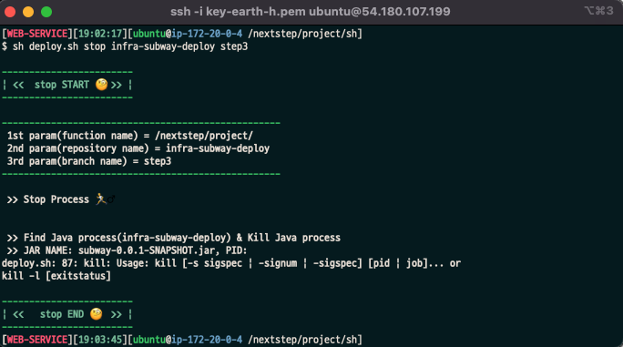
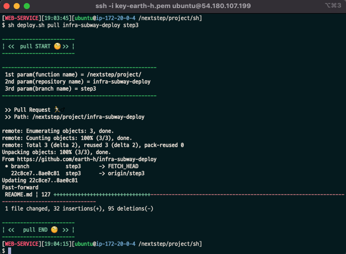
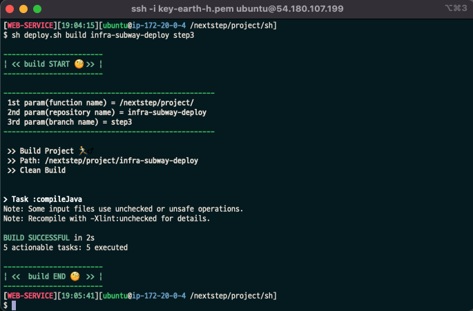
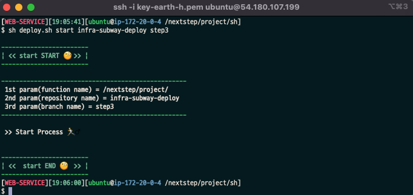
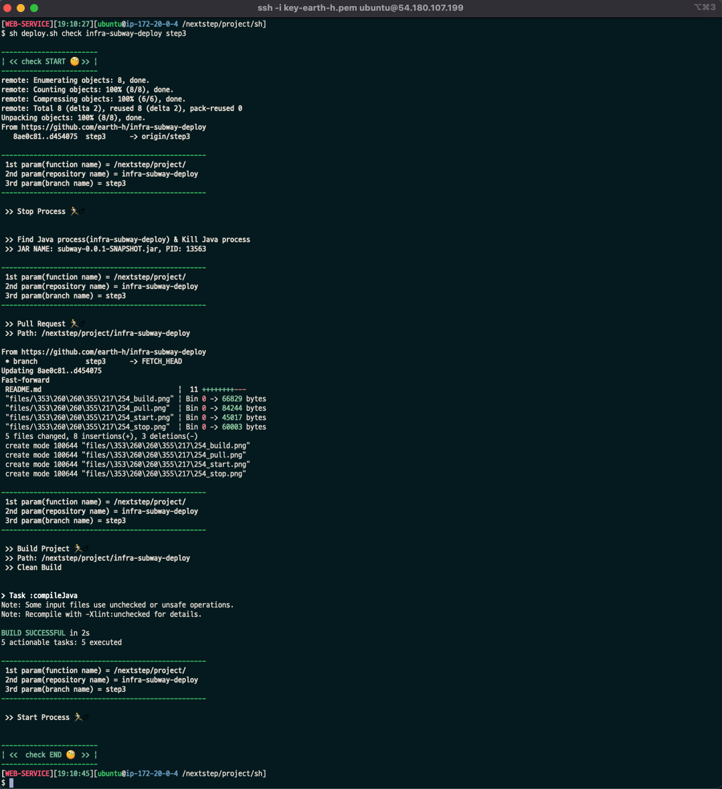

<p align="center">
    
</p>
<p align="center">
  
  
  <a href="https://edu.nextstep.camp/c/R89PYi5H" alt="nextstep atdd">
    
  </a>
  
</p>

<br>

# 인프라공방 샘플 서비스 - 지하철 노선도

<br>

## 🚀 Getting Started

### Install
#### npm 설치
```
cd frontend
npm install
```
> `frontend` 디렉토리에서 수행해야 합니다.

### Usage
#### webpack server 구동
```
npm run dev
```
#### application 구동
```
./gradlew clean build
```
<br>

## 미션

* 미션 진행 후에 아래 질문의 답을 README.md 파일에 작성하여 PR을 보내주세요.

### 0단계 - pem 키 생성하기

1. 서버에 접속을 위한 pem키를 [구글드라이브](https://drive.google.com/drive/folders/1dZiCUwNeH1LMglp8dyTqqsL1b2yBnzd1?usp=sharing)에 업로드해주세요

2. 업로드한 pem키는 무엇인가요.
- key-earth-h.pem (기존 key가 삭제되어 신규 key를 업로드 하였습니다.)

### 1단계 - 망 구성하기
1. 구성한 망의 서브넷 대역을 알려주세요
- 대역 : 
  - earth-h-public-subnet01 : 172.20.0.0/26
  - earth-h-public-subnet02 : 172.20.0.64/26
  - earth-h-private-subnet01 : 172.20.0.128/27
  - earth-h-admin-subnet01 : 172.20.0.160/27

2. 배포한 서비스의 공인 IP(혹은 URL)를 알려주세요
- URL : http://earth-h.tk:8080

#### 요구사항
**[ 망 구성 ]**
- [x] VPC 생성
  - CIDR은 C class(x.x.x.x/24)로 생성. 이 때, 다른 사람과 겹치지 않게 생성
- [x] Subnet 생성
  - 외부망으로 사용할 Subnet : 64개씩 2개 (AZ를 다르게 구성)
  - 내부망으로 사용할 Subnet : 32개씩 1개
  - 관리용으로 사용할 Subnet : 32개씩 1개
- [x] Internet Gateway 연결
- [x] Route Table 생성
- [x] Security Group 설정 
  - 외부망
    - [x] 전체 대역 : 8080 포트 오픈
    - [x] 관리망 : 22번 포트 오픈 
  - 내부망
    - [x] 외부망 : 3306 포트 오픈
    - [x] 관리망 : 22번 포트 오픈
  - 관리망
    - [x] 자신의 공인 IP : 22번 포트 오픈
    - [x] 외부망/내부망 : 514 포트 오픈 -> rsyslog TCP 로그 원격으로 남기기 위함
서버 생성
  - [x] 외부망에 웹 서비스용도의 EC2 생성
    - 베스천 서버 접근 후 `ssh ubuntu@earth-h-web-service` 접근 가능
    - `/nextstep/project/infra-subway-deploy/`에 infra-subway-deploy 프로젝트 클론
  - [x] 내부망에 데이터베이스용도의 EC2 생성
    - 베스천 서버 접근 후 `ssh ubuntu@earth-h-db` 접근 가능
  - [x] 관리망에 베스쳔 서버용도의 EC2 생성
    - `ssh -i earth-h.pem ubuntu@43.201.95.83` 접근 가능
  - [x] 베스쳔 서버에 Session Timeout 600s 설정
  - [x] 베스쳔 서버에 Command 감사로그 설정
    - /var/log/command.log 내 외부망, 베스천, 내부망 서버 모두의 command 입력 로그 남김
* 주의사항
  다른 사람이 생성한 리소스는 손대지 말아요 🙏🏻
  모든 리소스는 태그를 작성합니다. 이 때 자신의 계정을 Prefix로 붙입니다. (예: brainbackdoor-public)
**[ 웹 애플리케이션 배포 ]**
- [x] 외부망에 웹 애플리케이션을 배포
- [x] DNS 설정

---

### 2단계 - 배포하기
1. TLS가 적용된 URL을 알려주세요

- URL : https://earth-h.tk

#### 요구사항
**[ 운영 환경 구성하기 ]**
- [x] 웹 어플리케이션 앞단에 reverse proxy 구성하기
  - [x] 외부망에 nginx로 reverse proxy 구성
  - [x] reverse proxy에 TLS 설정
- [x] 운영 데이터베이스 구성하기
**[ 개발 환경 구성하기 ]**
- [x] 설정 파일 나누기
  - JUnit: H2 -> application-test.yml
  - Local: docker(mysql) -> application-local.yml
  - Prod: 운영 DB 사용하도록 설정 -> application-prod.yml

#### 작업 내용
- nginx 설정 시, 로그를 서버 내에서 보고자 docker-compose 이용해 volumes 지정
  - dockerfile과 docker-compose 경로: `ssh ubuntu@earth-h-web-service` 접근 후 `cd /nextstep/sw/nginx/.` 내에 존재
    - nginx 로그 위치: /nextstep/sw/nginx/logs/access.log, error.log
  - docker-compose 사용 시, `docker-compose : Unsupported config option for services services: 'nginx'`에러가 발생하여서, docker-compose는 힌트에서 적힌 버전이 아닌 최신 버전 설치함
  ```bash
  sudo curl -L https://github.com/docker/compose/releases/download/v2.12.2/docker-compose-linux-x86_64 -o /usr/local/bin/docker-compose
  sudo chmod +x /usr/local/bin/docker-compose
  ```
- http://earth-h.tk -> https://earth-h.tk 리다이렉트 설정
- AWS에 띄워둔 EC2 내에 fork한 레포지토리를 클론하여 현재 step의 yml을 가지고 prod 환경으로 어플리케이션 띄움
  - `nohup java -Dspring.profiles.active=prod -jar subway-0.0.1-SNAPSHOT.jar 1> /nextstep/log/202211190044.log 2>&1 &`
  - 어플리케이션 로그 위치: /nextstep/log/202211190044.log
- private subnet에 인터넷을 통해 docker를 설정하고자 NAT gateway 설정
  - 참고자료: https://www.linkedin.com/pulse/connecting-internet-from-ec2-instance-private-subnet-aws-thandra/
- 운영 DB에 어떤 database로 생성되어있는지 확인
  ```bash
  [DB][00:09:50][ubuntu@ip-172-20-0-152 ~] $ docker exec -it naughty_meitner bash
  root@948bd7b6557f:/# mysql -u root -p
  Enter password:
  ...
  mysql> show databases;
  +--------------------+
  | Database           |
  +--------------------+
  | information_schema |
  | mysql              |
  | performance_schema |
  | subway             |
  | sys                |
  +--------------------+
  5 rows in set (0.00 sec)
  
  mysql> use subway;
  Reading table information for completion of table and column names
  You can turn off this feature to get a quicker startup with -A
  
  Database changed
  mysql> show tables;
  +------------------+
  | Tables_in_subway |
  +------------------+
  | favorite         |
  | line             |
  | member           |
  | section          |
  | station          |
  +------------------+
  5 rows in set (0.00 sec)
  ```
---

### 3단계 - 배포 스크립트 작성하기

1. 작성한 배포 스크립트를 공유해주세요.
```shell
#!/bin/bash

## set variable

txtrst='\033[1;37m' # White
txtylw='\033[1;33m' # Yellow
txtgrn='\033[1;32m' # Green

PROJECT_PATH='/nextstep/project/'
LOG_PATH='/nextstep/log/'
FUNC_NAME=$1
REPO_NAME=$2
BRANCH_NAME=$3
CURRENT_TIME=$(date "+%Y%m%d%H%M")
JAR_NAME=''
PID=''

FIX_LENGTH_FUNC_NAME=$(printf "%5.5s" "$FUNC_NAME")

begin() {
  echo "\n${txtylw}------------------------${txtrst}"
  echo "${txtgrn}| << ${FIX_LENGTH_FUNC_NAME} START 🧐 >> |${txtrst}"
  echo "${txtylw}------------------------${txtrst}"
}

info() {
  echo "\n${txtylw}---------------------------------------------------${txtrst}"
  echo " 1st param(function name) = ${PROJECT_PATH}"
  echo " 2nd param(repository name) = ${REPO_NAME}"
  echo " 3rd param(branch name) = ${BRANCH_NAME}"
  echo "${txtylw}---------------------------------------------------${txtrst}"
}

guide() {
  echo "${txtylw}============================================================================================================${txtrst}"
  echo " 1st param(function name) = guide, pull, build, start, stop 중 하나"
  echo " 2st param(repository name) = ${PROJECT_PATH} 내에 존재하는 github repository명(예: infra-subway-deploy)"
  echo " 3rd param(branch name) = 2st param 내 존재하는 대상 branch명(예: earth-h)"
  echo "${txtylw}============================================================================================================${txtrst}"
}

pull() {
  info;

  echo "\n >> Pull Request 🏃♂️ \n >> Path: ${PROJECT_PATH}${REPO_NAME}\n"
  cd ${PROJECT_PATH}${REPO_NAME} && git pull origin ${BRANCH_NAME}
}

build() {
  info;

  echo "\n >> Build Project 🏃♂️ \n >> Path: ${PROJECT_PATH}${REPO_NAME}\n >> Clean Build\n"
  cd ${PROJECT_PATH}${REPO_NAME} && ./gradlew clean build -x test
}

find_jar() {
  if [ ! -d ${PROJECT_PATH}${REPO_NAME}/build/libs ]
  then
    echo "${PROJECT_PATH}${REPO_NAME}/build/libs not exists!"
    exit 0
  fi
  echo "$(cd ${PROJECT_PATH}${REPO_NAME}/build/libs && find ./* -name "*jar" | awk -F './' '{print $2}')"
}

find_pid() {
  if [ "${JAR_NAME}" = "${PROJECT_PATH}${REPO_NAME}/build/libs not exists!" ]
  then
    echo "can't find PID because there is no jar file!"
  else
    echo "$(ps -ef | grep ${JAR_NAME} | grep -v grep | awk '{print $2}')"
  fi
}

stop_process() {
  info;

  echo "\n >> Stop Process 🏃♂️ \n"

  JAR_NAME=$(find_jar)
  PID=$(find_pid)

  if [ "${PID}" = "can't find PID because there is no jar file!" ]
  then
    echo "프로세스가 현재 실행중이지 않습니다."
  else
    echo "\n >> Find Java process(${REPO_NAME}) & Kill Java process\n >> JAR NAME: ${JAR_NAME}, PID: ${PID}"
    kill ${PID}
  fi
}

start_process() {
  info;

  echo "\n >> Start Process 🏃♂️ \n"

  JAR_NAME=$(find_jar)

  if [ "${JAR_NAME}" = "${PROJECT_PATH}${REPO_NAME}/build/libs not exists!" ]
  then
    echo "실행핧 수 있는 jar 파일이 존재하지 않습니다."
  elif [ -n "$(find_pid)" ]
  then
    echo "이미 실행 중인 프로세스가 존재합니다. 재시작을 원하시면 stop을 먼저 진행해야 합니다."
  else
    nohup java -jar ${PROJECT_PATH}${REPO_NAME}/build/libs/${JAR_NAME} 1> ${LOG_PATH}${REPO_NAME}_${CURRENT_TIME}.log 2>&1 &
  fi
}

check() {
  if [ ! -d ${PROJECT_PATH}${REPO_NAME} ]
  then
    echo "${PROJECT_PATH}${REPO_NAME} is not exists!"
    exit 0
  fi

  cd ${PROJECT_PATH}${REPO_NAME} && git fetch
  master=$(cd ${PROJECT_PATH}${REPO_NAME} && git rev-parse ${BRANCH_NAME})
  remote=$(cd ${PROJECT_PATH}${REPO_NAME} && git rev-parse origin)

  if [ "$master" = "$remote" ]
  then
    echo "[${CURRENT_TIEM}] Nothing to do!!! 😫"
    exit 0
  else
    stop_process;
    pull;
    build;
    start_process;
  fi
}

end() {
  echo "\n${txtylw}------------------------${txtrst}"
  echo "${txtgrn}| <<  ${FIX_LENGTH_FUNC_NAME} END 🧐  >> |${txtrst}"
  echo "${txtylw}------------------------${txtrst}"
}

begin;

case ${FUNC_NAME} in
  guide)
    guide
    ;;
  pull)
    pull
    ;;
  build)
    build
    ;;
  stop)
    stop_process
    ;;
  start)
    start_process
    ;;
  check)
    check
    ;;
esac

end;
```
- jar 파일 실행 시, jar가 있는지 먼저 확인한 후 진행
- jar가 있을 경우에먼 pid를 체크하며, pid가 없다면 현재 process가 떠있지 않다고 판단하여 stop 진행하지 않음
- 이미 process가 떠있을 때 start하려고 stop 후 start하라는 얼럿 발생시킴

**[ 스크립트 사용법 ]**
- 스크립트 위치: /nextstep/project/sh/deploy.sh
- 로그 생성 위치: /nextstep/log/[프로젝트명(infra-subway-deploy)]_[날짜(예:202211191728)].log
- 스크립트 사용법
  - 스크립트 실행 시, 넣어야 하는 변수 가이드: `sh deploy.sh guide`
  - earth-h 브랜치 pull: `sh deploy.sh pull infra-subway-deploy step3`
  - infra-subway-deploy 프로젝트 build: `sh deploy.sh build infra-subway-deploy step3`
  - infra-subway-deploy 프로젝트를 earth-h 브랜치로 실행: `sh deploy.sh start infra-subway-deploy step3`
  - infra-subway-deploy 프로젝트 프로세스를 종료: 'sh deploy.sh stop infra-subway-deploy step3'
  - 원격 저장소와 서버 내 레포 변경 사항 있을 경우 pull, build, 프로세스 시작 진행: `sh deploy.sh check infra-subway-deploy step3`

**[ 스크립트 사용 예시 ]**
- STOP

- PULL

- BUILD

- START

- CHECK


#### 요구사항
- [x] 반복적으로 실행하더라도 정상적으로 배포하는 스크립트 작성하기
  - [x] 반복적으로 사용하는 명령어에 대해 함수로 작성
- [x] 크론탭을 통해 브랜치에 변경이 있는 경우, 원격 브랜치 땡겨서 가져오고 process 재실행하도록 설정
  - `0 * * * * /nextstep/project/sh/deploy.sh check infra-subway-deploy step3`
    - 매시간마다 수행하도록 설정(1시, 2시, 3시...)
