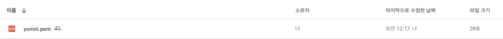
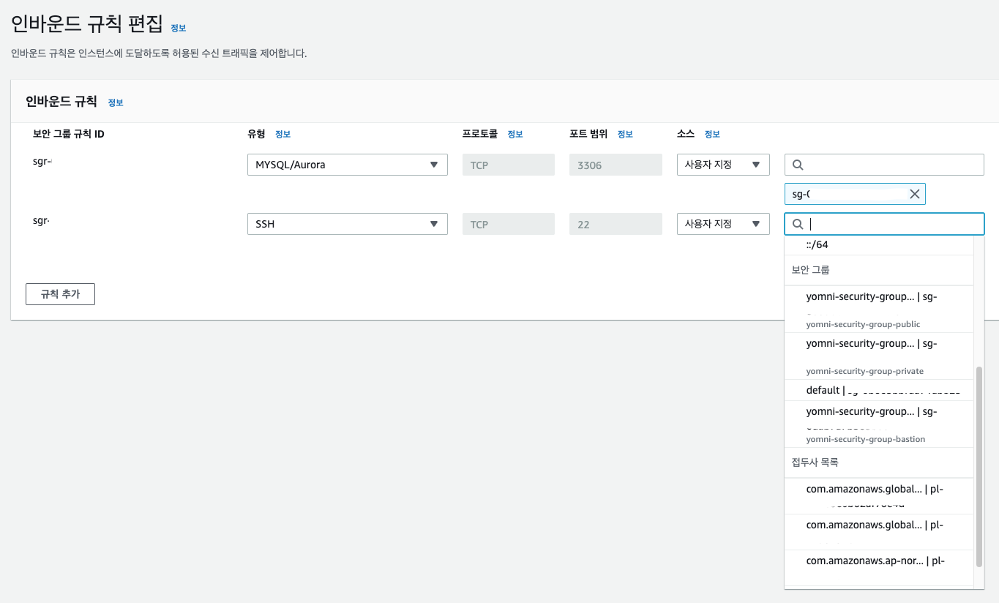

<p align="center">
    
</p>
<p align="center">
  
  
  <a href="https://edu.nextstep.camp/c/R89PYi5H" alt="nextstep atdd">
    
  </a>
  
</p>

<br>

# 인프라공방 샘플 서비스 - 지하철 노선도

<br>

## 🚀 Getting Started

### Install
#### npm 설치
```
cd frontend
npm install
```
> `frontend` 디렉토리에서 수행해야 합니다.

### Usage
#### webpack server 구동
```
npm run dev
```
#### application 구동
```
./gradlew clean build
```
<br>

## 미션

* 미션 진행 후에 아래 질문의 답을 README.md 파일에 작성하여 PR을 보내주세요.

### 0단계 - pem 키 생성하기

1. 서버에 접속을 위한 pem키를 [구글드라이브](https://drive.google.com/drive/folders/1dZiCUwNeH1LMglp8dyTqqsL1b2yBnzd1?usp=sharing)에 업로드해주세요
  - [x] 업로드 완료
2. 업로드한 pem키는 무엇인가요.
  - [x] yomni.pem  




### 1단계 - 망 구성하기
1. 구성한 망의 서브넷 대역을 알려주세요
- 대역 : 192.168.45.0/25
  - 외부망-1 : 192.168.45.0/26
  - 외부망-2 : 192.168.45.64/26
  - 내부망-1 : 192.168.45.128/27
  - 관리용-1 : 192.168.45.160/27

2. 배포한 서비스의 공인 IP(혹은 URL)를 알려주세요

- URL : http://yomni-runningmap.kro.kr:8080/
- 공인IP : 43.201.19.247:8080

#### 1단계 피드백
- [x] 보안그룹 설정 시 인스턴스의 ip가 아닌 보안 그룹으로 설정
  - 한번 더 생각해보면 당연한것이.. 혹시나 vpc 대역 ip가 변경된다면?(~~그럴일은 많이 없겠지만..~~)  
  보안그룹에 인스턴스의 ip가 박혀있다면 꽤나 귀찮은 일이 될 것..  
  이런 차원에서 보면, 보안그룹의 소스를 다른 보안그룹의 ID로 설정할 수 있다는 것 자체가 AWS의 편의성이 얼마나 뛰어난 지 보여주는 예시 인 것 같음!



---

### 2단계 - 배포하기
1. TLS가 적용된 URL을 알려주세요

- URL : 

#### Action Items
- [ ] 운영 환경 구성하기
  - [ ] 웹 애플리케이션 앞에 `Reverse Proxy` 구성하기 
    - [ ] docker 설치 강의 설명 페이지에서 도커 설치 힌트 스크립트가 현재와 맞지않아 조금 조정이 필요했습니다. 공식 홈페이지의 설치매뉴얼을 참고했습니다. 
      - [Install Docker Engine on Ubuntu](https://docs.docker.com/engine/install/ubuntu/)
      - [Install the Compose plugin](https://docs.docker.com/compose/install/linux/)
    - [ ] 외부망(public)에 `nginx`로 `Reverse Proxy`를 구성
    - [ ] `Reverse Proxy`에 `TLS` 설정
  - [ ] 운영 데이터베이스 구성하기

---

### 3단계 - 배포 스크립트 작성하기

1. 작성한 배포 스크립트를 공유해주세요.


