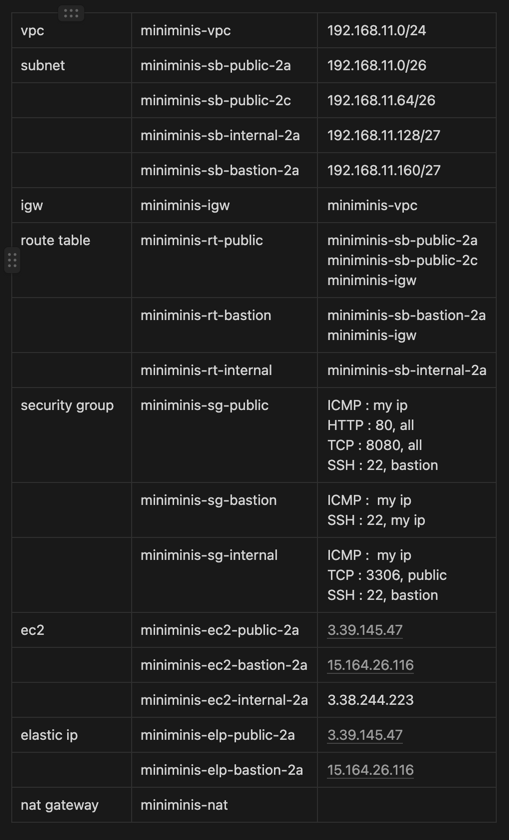

<p align="center">
    
</p>
<p align="center">
  
  
  <a href="https://edu.nextstep.camp/c/R89PYi5H" alt="nextstep atdd">
    
  </a>
  
</p>

<br>

# 인프라공방 샘플 서비스 - 지하철 노선도

<br>

## 🚀 Getting Started

### Install
#### npm 설치
```
cd frontend
npm install
```
> `frontend` 디렉토리에서 수행해야 합니다.

### Usage
#### webpack server 구동
```
npm run dev
```
#### application 구동
```
./gradlew clean build
```
<br>

## 미션

* 미션 진행 후에 아래 질문의 답을 README.md 파일에 작성하여 PR을 보내주세요.

### 1단계 - 망 구성하기
1. 구성한 망의 서브넷 대역을 알려주세요
- 대역 :
    * 외부망 서브넷 1(applemango2021-public-1) : 192.168.77.0/26
    * 외부망 서브넷 2(applemango2021-public-2) : 192.168.77.64/26
    * 관리망 서브넷(applemango2021-admin) : 192.168.77.128/27
    * 내부망 서브넷(applemango2021-private) : 192.168.77.160/27
    
2. 배포한 서비스의 공인 IP(혹은 URL)를 알려주세요

- URL : 
    * 공인 IP : 3.34.50.96
    * URL : http://subway.applemango2021.kro.kr:8080

3. 베스천 서버에 접속을 위한 pem키는 [구글드라이브](https://drive.google.com/drive/folders/1dZiCUwNeH1LMglp8dyTqqsL1b2yBnzd1?usp=sharing)에 업로드해주세요

    - pem키는 [여기](https://drive.google.com/file/d/1nf_7LqYkAIevUdPv5HSNtT0BHo1h9FK6/view?usp=sharing )에서 다운받으시면 됩니다!
---

### 2단계 - 배포하기
1. TLS가 적용된 URL을 알려주세요

- URL : 

## 요구사항
### 1. 운영환경 구성하기 

*[ ] 웹 애플리케이션 앞단에 Reverse Proxy 구성하기 
  * [x] 외부망에 Nginx로 Reverse Proxy를 구성

    → 외부망에 있던 기존 web service용 서버 내에 도커를 이용하여 구성 
      1. 외부망 보안그룹 인바운드 규칙 수정 
         * 전체 대역 : 80포트 오픈 
          * 8080 포트 삭제 (Nginx를 통해서 80 포트를 통해 요청이 들어올 것!)
      1. **web $** Docker 설치
      2. **web $** Nginx용 이미지 생성을 위한 `nginx.conf` 파일 생성 
         ```dockerfile
         events {}
         
         # 1. http 트래픽에 대한 설정
         http {
            # 5. upstream : nginx 서버에 들어온 요청을 전달해줄 application server 정의 
            upstream app {  
                # 6. 아래 location에 의해서 들어온 요청을 아래 정의된 server들에 분배한다. 
                # (현재는 server가 1개만 정의되어 있지만 여러개일 수 있다)
                server 172.17.0.1:8080; 
            }
            
            # 2. http 트래픽에 대한 요청을 처리할 서버 1번 (또 다른 server 블록을 생성할 수도 있다)
            server {
                # 3. 80번 포트와 연결되어 있음
                listen 80;
            
                # 4. uri '/'로 들어온 요청은 모두 app(upstream)로 중계할 것
                location / {
                proxy_pass http://app;
                }
            }
         }
         ```
      3. **web $** `Dockerfile` 생성
         ```dockerfile
         # FROM : 이미지를 만들 때 기반이 되는 이미지 선언
         FROM nginx 
         
         # COPY 문법
         # 용도 : Host 환경의 파일을 컨테이너 이미지 안으로 복사
         # 사용법 : 
         # - COPY <복사할 파일 경로> <이미지에서 파일이 위치할 경로>
         # - <복사할 파일 경로> → 컨텍스트 아래(아마 루트)를 기준으로 작성
         # - 즉, 아래 문법은, nginx 저장소의 이미지로부터 새로운 이미지를 만들 때, 
         # Host 환경의 nginx.conf 파일을 /etc/nginx/nginx.conf에 덮어쓴다는 의미   
         COPY nginx.conf /etc/nginx/nginx.conf
         ```
         
    4. **web $** `Dockerfile` 통해서 이미지 빌드 
       ```
        web $ docker build -t nextstep/reverse-proxy .
       ```
       → 실행결과
        
       
    5. **web $** `Dockerfile` 통해서 컨테이너 생성 및 작동    
       ```
        # -d 옵션 : 백그라운드로 실행
        # -p 옵션 : Host의 포트로 들어온 정보를 컨테이너의 포트로 전달하는 옵션 (앞 포트가 Host의 포트)
        web $ docker run -d -p 80:80 nextstep/reverse-proxy
       ```
       → 실행결과
        
        
        → host환경에서 http://localhost 접속 시 응답코드
       
    

  * [X] Reverse Proxy에 TLS 설정
        
    a. 외부망 보안그룹 인바운드 규칙 수정 
        
    * 전체 대역 : 443 포트 오픈 
      
    b. `nginx.conf` 및 `Dockerfile` 수정 
    
    c. 새로운 도커 이미지(`nextstep/reverse-proxy:1.0.0`) 및 컨테이너 생성
    ```
    web $ docker build -t nextstep/reverse-proxy:1.0.0 .
    web $ docker run -d -p 80:80 -p 443:443 --name proxy nextstep/reverse-proxy:1.0.0
    ```  
    
  *[ ] 📍운영 데이터베이스 구성하기
  
    a. 내부망용 서브넷 라우팅 테이블 임시로 변경
    - internal용 라우팅 테이블 사용시 key 등록을 위한 최초 접속이 불가능함)
    - 이후부터는 bastion 서버만을 통해 접속
    
    b. **db $** Docker 설치 

    c. **db $** DB 컨테이너 구동 
    ```
    db $  docker run -d -p 3306:3306 --name prod-db brainbackdoor/data-subway:0.0.1
    ```
  
### 2. 개발 환경 구성하기
  * [ ] 설정 파일 나누기 
      * [x] JUnit : h2 
      * [x] Local : docker(mysql)
      * Prod : 운영 DB를 사용하도록 설정
  * [ ] 데이터베이스 테이블 스키마 버전 관리
  * [ ] SonarLint 설정하기
  * [ ] MultiRun 설정하기
