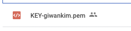

<p align="center">
    
</p>
<p align="center">
  
  
  <a href="https://edu.nextstep.camp/c/R89PYi5H" alt="nextstep atdd">
    
  </a>
  
</p>

<br>

# 인프라공방 샘플 서비스 - 지하철 노선도

<br>

## 🚀 Getting Started

### Install

#### npm 설치

```
cd frontend
npm install
```

> `frontend` 디렉토리에서 수행해야 합니다.

### Usage

#### webpack server 구동

```
npm run dev
```

#### application 구동

```
./gradlew clean build
```

<br>

## 미션

- 미션 진행 후에 아래 질문의 답을 README.md 파일에 작성하여 PR을 보내주세요.

### 0단계 - pem 키 생성하기

1. 서버에 접속을 위한 pem키를 [구글드라이브](https://drive.google.com/drive/folders/1dZiCUwNeH1LMglp8dyTqqsL1b2yBnzd1?usp=sharing)에 업로드해주세요



2. 업로드한 pem키는 무엇인가요.

KEY-giwankim.pem

### 1단계 - 망 구성하기

1. 구성한 망의 서브넷 대역을 알려주세요

- vpc: 192.168.1.0/24
  - public-a: 192.168.1.0/26
  - public-c: 192.168.1.64/26
  - internal-a: 192.168.1.128/27
  - bastion-c: 192.168.1.160/27

2. 배포한 서비스의 공인 IP(혹은 URL)를 알려주세요

- URL : http://gwk.kro.kr:8080

---

### 2단계 - 배포하기

1. TLS가 적용된 URL을 알려주세요

- URL : https://gwk.kro.kr

---

### 3단계 - 배포 스크립트 작성하기

1. 작성한 배포 스크립트를 공유해주세요.
```shell
#!/bin/bash

## 변수 설정
EXECUTION_PATH=$(pwd)
SHELL_SCRIPT_PATH=$(dirname $0)
BRANCH=$1
PROFILE=$2

PROJECT_NAME=infra-subway-deploy
REPOSITORY=/home/ubuntu/nextstep/$PROJECT_NAME

txtrst='\033[1;37m' # White
txtred='\033[1;31m' # Red
txtylw='\033[1;33m' # Yellow
txtpur='\033[1;35m' # Purple
txtgrn='\033[1;32m' # Green
txtgra='\033[1;30m' # Gray

## 조건 설정
if [[ $# -ne 2 ]]; then
  echo -e "${txtylw}=======================================${txtrst}"
  echo -e "${txtgrn}  << 스크립트 🧐 >>${txtrst}"
  echo -e ""
  echo -e "${txtgrn} $0 브랜치이름 ${txtred}{ prod | dev }"
  echo -e "${txtylw}=======================================${txtrst}"
  exit
fi

function pull() {
  echo -e "${txtylw}=======================================${txtrst}"
  echo -e ">> Pull Request 🏃"
  git pull origin $BRANCH
  echo -e "${txtylw}=======================================${txtrst}"
}

function build() {
  echo -e "${txtylw}=======================================${txtrst}"
  echo -e ">> Gradle clean build 🏃"
  ./gradlew clean build
  echo -e ""
  echo -e ">> Build 파일 복사 🏃"
  cp $REPOSITORY/build/libs/*.jar $REPOSITORY
  echo -e "${txtylw}=======================================${txtrst}"
}

function kill() {
  echo -e "${txtylw}=======================================${txtrst}"
  echo -e ">> 현재 구동중인 애플리케이션 pid 확인 🏃"
  CURRENT_PID=$(pgrep -f subway*.jar)
  echo -e "> 현재 구동중인 애플리케이션 pid: $CURRENT_PID"
  if [ -z "$CURRENT_PID" ]; then
    echo "> 현재 구동 중인 애플리케이션이 없으므로 종료하지 않습니다."
  else
    echo "> kill -15 $CURRENT_PID"
    kill -15 $CURRENT_PID
    sleep 5
  fi
  echo -e "${txtylw}=======================================${txtrst}"
}

function start() {
  echo -e "${txtylw}=======================================${txtrst}"
  echo -e ">> 새 애플리케이션 배포 🏃"
  JARFILE=$(ls -tr $REPOSITORY/ | grep jar | tail -n 1)
  echo -e ${JARFILE}
  echo -e "-Dspring.profiles.active=${PROFILE}"
  nohup java -jar -Dspring.profiles.active=$PROFILE $JARFILE 1>$REPOSITORY/logs/$PROFILE 2>&1 &
  echo -e "${txtylw}=======================================${txtrst}"
}

function check_df() {
  git fetch
  master=$(git rev-parse $BRANCH)
  remote=$(git rev-parse origin/$BRANCH)

  if [[ $master == $remote ]]; then
    echo -e "[$(date)] Nothing to do !!! 😫"
    exit 0
  else
    echo -e "> 리모트 브랜치가 변동되었습니다."
    echo -e "> 로컬 브랜치를 업데이트하고, 다시 배포하겠습니다."
    pull
    build
    kill
    start
  fi
}

## 프로젝트 디렉토리로 이동
cd $REPOSITORY
check_df
```
