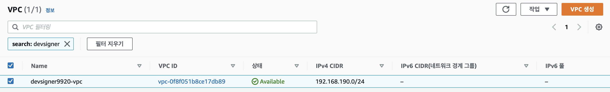
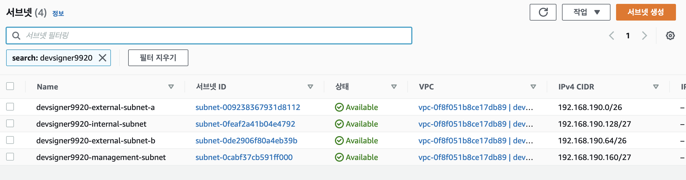
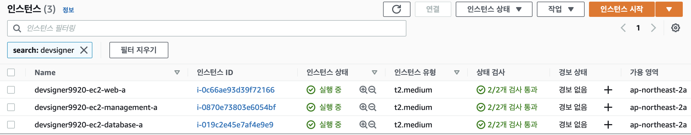

<p align="center">
    
</p>
<p align="center">
  
  
  <a href="https://edu.nextstep.camp/c/R89PYi5H" alt="nextstep atdd">
    
  </a>
  
</p>

<br>

# 인프라공방 샘플 서비스 - 지하철 노선도

<br>

## 🚀 Getting Started

### Install
#### npm 설치
```
cd frontend
npm install
```
> `frontend` 디렉토리에서 수행해야 합니다.

### Usage
#### webpack server 구동
```
npm run dev
```
#### application 구동
```
./gradlew clean build
```
<br>

## 미션

* 미션 진행 후에 아래 질문의 답을 README.md 파일에 작성하여 PR을 보내주세요.

### 1단계 - 망 구성하기
1. 구성한 망의 서브넷 대역을 알려주세요
- VPC 대역: 192.168.190.0/24
- VPC 명: vpc-0f8f051b8ce17db89 / devsigner9920-vpc
> 
- 서브넷
    - 외부망-a:
        - 대역: 192.168.190.0/26
        - 명: subnet-009238367931d8112 / devsigner9920-external-subnet-a
        - AZ: ap-northeast-2a
    - 외부망-b:
        - 대역: 192.168.190.64/26
        - 명: subnet-0de2906f80a4eb39b / devsigner9920-external-subnet-b
        - AZ: ap-northeast-2b
    - 내부망:
        - 대역: 192.168.190.128/27
        - 명: subnet-0feaf2a41b04e4792 / devsigner9920-internal-subnet
        - AZ: ap-northeast-2a
    - 내부망:
        - 대역: 192.168.190.160/27
        - 명: subnet-0cabf37cb591ff000 / devsigner9920-management-subnet
        - AZ: ap-northeast-2a
> 

2. 배포한 서비스의 공인 IP(혹은 URL)를 알려주세요
- URL : http://www.devsigner9920.n-e.kr:8080
> 


3. 베스천 서버에 접속을 위한 pem키는 [구글드라이브](https://drive.google.com/drive/folders/1dZiCUwNeH1LMglp8dyTqqsL1b2yBnzd1?usp=sharing)에 업로드해주세요
- 파일명: /pem/wootecam-pro-3/devsigner9920-private-key.pem

---

### 2단계 - 배포하기
1. TLS가 적용된 URL을 알려주세요

- URL : 
