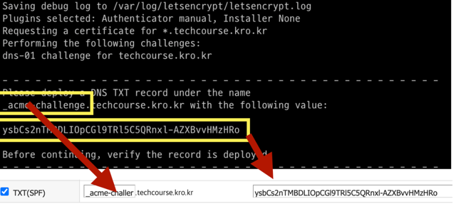
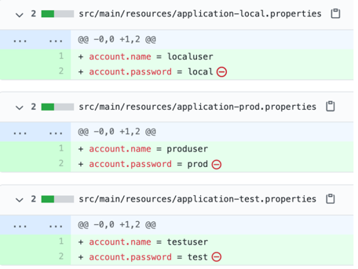

<p align="center">  
      
</p>  
<p align="center">  
    
    
  <a href="https://edu.nextstep.camp/c/R89PYi5H" alt="nextstep atdd">  
      
  </a>  
    
</p>  

<br>  

# 인프라공방 샘플 서비스 - 지하철 노선도

<br>  

## 🚀 Getting Started

### Install
#### npm 설치
```  
cd frontend  
npm install  
```  
> `frontend` 디렉토리에서 수행해야 합니다.

### Usage
#### webpack server 구동
```  
npm run dev  
```  
#### application 구동
```  
./gradlew clean build  
```  
<br>  

## 미션

* 미션 진행 후에 아래 질문의 답을 README.md 파일에 작성하여 PR을 보내주세요.

### 0단계 - pem 키 생성하기

1. 서버에 접속을 위한 pem키를 [구글드라이브](https://drive.google.com/drive/folders/1dZiCUwNeH1LMglp8dyTqqsL1b2yBnzd1?usp=sharing)에 업로드해주세요

2. 업로드한 pem키는 무엇인가요.  
   -> KEY-yeojiin.pem
### 1단계 - 망 구성하기
1. 구성한 망의 서브넷 대역을 알려주세요
- 대역 :
    * VPC IPv4 CIDR : 192.168.34.0/24
    * 외부망1: 192.168.34.0/26
    * 외부망2: 192.168.34.64/26
    * 관리망: 192.168.34.160/27
    * 내부망: 192.168.34.128/27

2. 배포한 서비스의 공인 IP(혹은 URL)를 알려주세요

- URL :
    * http://43.201.105.251:8080/
    * http://yeojiin-subway.o-r.kr:8080/


  
---  

### 2단계 - 배포하기
1. TLS가 적용된 URL을 알려주세요

- URL : https://yeojiin-subway.o-r.kr/

---  

### 3단계 - 배포 스크립트 작성하기

1. 작성한 배포 스크립트를 공유해주세요.
    - deploy.sh

***  


### 힌트 1
<details>  
<summary> </summary>  

### 🚀 1단계 - 서비스 구성하기
## 요구사항

* [x] 웹 서비스를 운영할 네트워크 망 구성하기
* [x] 웹 애플리케이션 배포하기

### 요구사항 설명
* 저장소를 활용하여 아래 요구사항을 해결합니다.
* README 에 있는 질문에 답을 추가한 후 PR을 보내고 리뷰요청을 합니다.

### 망 구성
* [x] VPC 생성
    * [x] CIDR은 C class(x.x.x.x/24)로 생성. 이 때, 다른 사람과 겹치지 않게 생성
* [x] Subnet 생성
    * [x] 외부망으로 사용할 Subnet : 64개씩 2개 (AZ를 다르게 구성)
    * [x] 내부망으로 사용할 Subnet : 32개씩 1개
    * [x] 관리용으로 사용할 Subnet : 32개씩 1개
* [x] Internet Gateway 연결
* [x] Route Table 생성
* [x] Security Group 설정
    * [x] 외부망
        * 전체 대역 : 8080 포트 오픈
        * 관리망 : 22번 포트 오픈
    * [x] 내부망
        * 외부망 : 3306 포트 오픈
        * 관리망 : 22번 포트 오픈
    * [x] 관리망
        * 자신의 공인 IP : 22번 포트 오픈
* [x] 서버 생성
    * [x] 외부망에 웹 서비스용도의 EC2 생성
    * [x] 내부망에 데이터베이스용도의 EC2 생성
    * [x] 관리망에 베스쳔 서버용도의 EC2 생성
    * [x] 베스쳔 서버에 Session Timeout 600s 설정
    * [x] 베스쳔 서버에 Command 감사로그 설정

### 주의사항
**모든 리소스는 태그를 작성합니다. 이 때 자신의 계정을 Prefix로 붙입니다. (예: brainbackdoor-public)**

### 웹 애플리케이션 배포
* [x] 외부망에 웹 애플리케이션을 배포
* [x] DNS 설정

***

### 🚀 2단계 - 서비스 배포하기

## 요구사항
* [x] 운영 환경 구성하기
* [x] 개발 환경 구성하기

### 요구사항 설명
운영 환경 구성하기
* [x] 웹 애플리케이션 앞단에 Reverse Proxy 구성하기
    * [x] 외부망에 Nginx로 Reverse Proxy를 구성
    * [x] Reverse Proxy에 TLS 설정
* [x] 운영 데이터베이스 구성하기     
  운영 환경 구성하기
* [x] 설정 파일 나누기
    * JUnit : h2, Local : docker(mysql), Prod : 운영 DB를 사용하도록 설정

***

### 🚀 3단계 - 배포 스크립트 작성하기

## 요구사항
* [x] 배포 스크립트 작성하기
  * 아래 내용을 모두 반영할 필요는 없습니다. 반복적으로 실행하더라도 정상적으로 배포하는 스크립트를 작성해봅니다.

***


### 힌트 1
<details>
<summary> </summary>

1. EC2 생성하기</br>
   A. aws web console에 사용자 이름 / 비밀번호 등을 입력하여 접속합니다.   </br>
   B. EC2 메뉴로 접근하세요.</br>
   a. Ubuntu 64 bit 선택 (Ubuntu Server 18.04 LTS (HVM), SSD Volume Type - ami-00edfb46b107f643c)</br>
   b. InstanceType : t4g.medium 생성 가능</br>
   c. 서브넷 : 적절한 서브넷 선택, 퍼블릭 IP 자동할당 : 활성화</br>
   d. 스토리지 : 서비스 운영할 것을 고려해서 설정해주세요.</br>
   e. 서버를 생성할 때는 다른 사람의 서버와 구분하기 위해 반드시 Name 이름으로 태그에 자신의 계정명을 작성합니다.</br>
   f. 보안그룹 : 적절한 보안그룹을 선택</br>
   g. 키 페어 생성</br>
    * 키 페어 이름에 자신의 계정을 prefix로 붙입니다.

    ```
    서버 생성시 발급받은 key를 분실할 경우 서버에 접속할 수 없어요. key를 분실하지 않도록 주의하세요,
    key는 최초 1회 생성한 후 재사용합니다.
    
    서버를 사용하지 않을 때는 stop해주세요.
    ```

   C. 서버에 접속하기
    * 서버 IP는 aws web console에서 확인 가능 <br><br>
   ```
   맥운영체제 사용자
    # 터미널 접속한 후 앞 단계에서 생성한 key가 위치한 곳으로 이동한다.
    $ chmod 400 [pem파일명]
    $ ssh -i [pem파일명] ubuntu@[SERVER_IP]
   
   윈도우 운영체제 사용자
    PuTTY를 사용하여 Windows에서 Linux 인스턴스에 연결
    putty를 위한 ppk 생성
   ```   

2. 접근제어
   Bastion Server로 사용할 별도의 EC2를 생성하고, Bastion Server에서 서비스용 서버에 ssh 연결을 설정
```
## Bastion Server에서 공개키를 생성합니다.
bastion $ ssh-keygen -t rsa
bastion $ cat ~/.ssh/id_rsa.pub

## 접속하려는 서비스용 서버에 키를 추가합니다.
$ vi ~/.ssh/authorized_keys

## Bastion Server에서 접속을 해봅니다.
bastion $ ssh ubuntu@[서비스용 서버 IP]
```   

* Bastion Server는 자신의 공인 IP에서만 22번 포트로 접근이 가능하도록 Security Group을 설정합니다.
* 서비스용 서버에 22번 포트로의 접근은 Bastion 서버에서만 가능하도록 Security Group을 설정합니다.
*  Bastion 서버에서 다른 서버에 접근이 용이하도록 별칭을 설정합니다.
```
bastion $ vi /etc/hosts
[서비스용IP]    [별칭]

bastion $ ssh [별칭]
```   

3. 서버 환경설정 해보기   
   a. 환경 병수 적용하기
* Sessio Timeout 설정을 하여 일정 시간 작업을 하지 않을 경우 터미널 연결을 해제할 수 있습니다.
```
$ sudo vi ~/.profile
  HISTTIMEFORMAT="%F %T -- "    ## history 명령 결과에 시간값 추가
  export HISTTIMEFORMAT
  export TMOUT=600              ## 세션 타임아웃 설정 
    
$ source ~/.profile
$ env
```
b. shell prompt 변경하기   
Bastion 등 구분해야 하는 서버의 Shell Prompt를 설정하여 관리자의 인적 장애를 예방할 수 있습니다.
```
$ sudo vi ~/.bashrc
  USERNAME=BASTION
  PS1='[\e[1;31m$USERNAME\e[0m][\e[1;32m\t\e[0m][\e[1;33m\u\e[0m@\e[1;36m\h\e[0m \w] \n\$ \[\033[00m\]'

$ source ~/.bashrc
```   
c. logger 를 사용하여 감사로그 남기기   
서버에 직접 접속하여 작업할 경우, 작업 이력 히스토리를 기록해두어야 장애 발생시 원인을 분석할 수 있습니다. 감사로그를 기록하고 수집해봅니다.
```
$ sudo vi ~/.bashrc
  tty=`tty | awk -F"/dev/" '{print $2}'`
  IP=`w | grep "$tty" | awk '{print $3}'`
  export PROMPT_COMMAND='logger -p local0.debug "[USER]$(whoami) [IP]$IP [PID]$$ [PWD]`pwd` [COMMAND] $(history 1 | sed "s/^[ ]*[0-9]\+[ ]*//" )"'

$ source  ~/.bashrc


$ sudo vi /etc/rsyslog.d/50-default.conf
  local0.*                        /var/log/command.log
  # 원격지에 로그를 남길 경우 
  local0.*                        @원격지서버IP
    
$ sudo service rsyslog restart
$ tail -f /var/log/command.log
```   
4. 환경 세팅   
   a.확인
```
# 현재 위치를 확인합니다.
$ pwd

# 파일시스템별 가용공간을 확인합니다.
$ df -h

# 각 디렉토리별로 디스크 사용량을 확인합니다.
$ sudo du -shc /*

# 현재 경로의 파일들(숨김파일 포함)의 정보를 확인합니다.
$ ls -al

# 소스코드를 관리할 디렉토리를 생성하고 이동합니다.
$ mkdir nextstep && cd nextstep

# git 명령어의 위치를 확인해봅니다.
$ which git && which java
```   
b. 자바 설치
```
$ sudo apt update
$ sudo apt install default-jre
$ sudo apt install default-jdk
```

5. 소스코드 배포, 빌드 및 실행   
   a. github repository clone   
   b. 빌드
    ```
   $ ./gradlew clean build

    # jar파일을 찾아본다.
    $ find ./* -name "*jar"
   ```      
   c. 실행   
   Application을 실행 후 정상적으로 동작하는지 확인해보세요.
    ```
   $ java -jar [jar파일명] &
    $ curl http://localhost:8080
   ```
    * -Dserver.port=8000 옵션을 활용하여 port를 변경할 수 있어요.
    * 서버를 시작 시간이 너무 오래 걸리는 경우 -Djava.security.egd 옵션을 적용해보세요.
    ```
    $ java -Djava.security.egd=file:/dev/./urandom -jar [jar파일명] &
    ```
    * 터미널 세션이 끊어질 경우, background로 돌던 프로세스에 hang-up signal이 발생해 죽는 경우가 있는데요. 이 경우 nohup명령어를 활용합니다.
   ```
    $  nohup java -jar [jar파일명] 1> [로그파일명] 2>&1  &
    ```
   d. 로그 확인
    ```
   # java applicaion이 남기는 로그를 확인합니다.
    $ tail -f [로그파일명]

    # 파일을 압축하고 파일 소유자와 모드를 변경해봅니다.
    $ tar -cvf [파일명] [압축할파일 또는 디렉터리]
    $ sudo chown [소유자계정명]:[소유그룹명] [file이름]
    $ chmod [옵션] [파일명]
    > https://ko.wikipedia.org/wiki/Chmod
   ```
    * 브라우저에서 http://{서버 ip}:{port}로 접근해보세요.

   e. 종료   
   a. 로세스 pid를 찾는 명령어
    ```
    $ ps -ef | grep java
    $ pgrep -f java
    ```
   b. 프로세스를 종료하는 명령어
   why not use SIGKILL
    ```
    $ kill -2 [PID]
    ```   

   f. 명령어 이력 확인
    ```
    $ history
    ```

</details>
</details>

***  

### 힌트 2
<details>  
<summary> </summary>

도커 설치
```  
$ sudo apt-get update && \  
sudo apt-get install -y apt-transport-https ca-certificates curl software-properties-common && \  
curl -fsSL https://download.docker.com/linux/ubuntu/gpg | sudo apt-key add - && \  
sudo apt-key fingerprint 0EBFCD88 && \  
sudo add-apt-repository "deb [arch=amd64] https://download.docker.com/linux/ubuntu $(lsb_release -cs) stable" && \  
sudo apt-get update && \  
sudo apt-get install -y docker-ce && \  
sudo usermod -aG docker ubuntu && \  
sudo curl -L "https://github.com/docker/compose/releases/download/1.23.2/docker-compose-$(uname -s)-$(uname -m)" -o /usr/local/bin/docker-compose && \  
sudo chmod +x /usr/local/bin/docker-compose && \  
sudo ln -s /usr/local/bin/docker-compose /usr/bin/docker-compose  
```  
* https://github.com/brainbackdoor/playground-docker/tree/master/week1
* 도커를 처음 접하셨다면 위 저장소를 clone 받은 후, step01부터 일단 명령어를 하나씩 따라하다보면, 개략적인 감을 잡을 수 있을거에요.   

### 1.Reverse Proxy
우리의 WAS는 비즈니스 로직만 담당하도록 구성하고 싶어요. TLS와 같은 부수적인 기능으로 애플리케이션에 직접 영향을 주고 싶지 않아요. 그럴 때 중간에 대신 역할을 수행하는 녀석이 필요한데, 여기서는 Reverse Proxy가 그 녀석입니다.        
Reverse Proxy는 클라이언트로부터의 요청을 받아서(필요하다면 주위에서 처리한 후) 적절한 웹 서버로 요청을 전송합니다. 웹 서버는 요청을 받아서 평소처럼 처리를 하지만, 응답을 클라이언트로 보내지 않고 Reverse Proxy로 반환합니다. 요청을 받은 Reverse Proxy는 그 응답을 클라이언트로 반환합니다.        
통상의 Proxy Server는 LAN -> WAN의 요청을 대리로 수행합니다. 가령, 특정 웹 서비스에 접속하고 싶은데 해당 서비스에서 한국 IP 대역을 막아두었다면, 다른 국가를 통해 접속할 때 Proxy를 활용합니다. 반면 Reverse Proxy는 WAN -> LAN의 요청을 대리합니다. 즉, 클라이언트로부터의 요청이 웹서버로 전달되는 도중의 처리에 끼어들어서 다양한 전후처리를 시행할 수가 있게 됩니다.   

* **Reverse Proxy와 Load Balancer는 어떤 차이가 있을까요?**
    * Reverse Proxy : 보안성 향상, 확장성 향상, 웹 가속(압축/SSL 처리로 백엔드 리소스 확보/캐싱)
    * Load Balancer : 부하분산, 서버상태 체크, 세션 관리  
      역할이라고 생각하면 좋겠어요. 가령, nginx는 Reverse Proxy, Load Balancer 두가지 역할을 수행할 수 있는건지요.

a. Dockerfile
```  
FROM nginx  
  
COPY nginx.conf /etc/nginx/nginx.conf  
```  
b. nginx.conf
```  
events {}  
  
http {  
upstream app {  
server 172.17.0.1:8080;  
}  
  
server {  
listen 80;  
  
    location / {      proxy_pass http://app;    }}  
}  
```  

```  
$ docker build -t nextstep/reverse-proxy .  
$ docker run -d -p 80:80 nextstep/reverse-proxy  
```  

### 2.TLS 설정
서버의 보안과 별개로 서버와 클라이언트간 통신상의 암호화가 필요합니다. 평문으로 통신할 경우, 패킷을 스니핑할 수 있기 때문입니다.

📌 letsencrypt를 활용하여 무료로 TLS 인증서를 사용할 수 있어요.
```  
$ docker run -it --rm --name certbot \  
  -v '/etc/letsencrypt:/etc/letsencrypt' \  -v '/var/lib/letsencrypt:/var/lib/letsencrypt' \  certbot/certbot certonly -d 'yourdomain.com' --manual --preferred-challenges dns --server https://acme-v02.api.letsencrypt.org/directory  
```  

📌 인증서 생성 후 유효한 URL인지 확인을 위해 DNS TXT 레코드로 추가합니다.  


```  
$ dig -t txt _acme-challenge.example.com +short  
```  
* DNS를 설정하는 사이트에서 DNS TXT 레코드를 추가한 후, 제대로 반영되었는지 dig 명령어로 확인한 후에 인증서 설정 진행을 계속합니다.

📌 생성한 인증서를 활용하여 Reverse Proxy에 TLS 설정을 해봅시다. 우선 인증서를 현재 경로로 옮깁니다.
```  
$ cp /etc/letsencrypt/live/[도메인주소]/fullchain.pem ./  
$ cp /etc/letsencrypt/live/[도메인주소]/privkey.pem ./  
```  

📌 Dockerfile 을 아래와 같이 수정합니다.
```  
FROM nginx  
  
COPY nginx.conf /etc/nginx/nginx.conf  
COPY fullchain.pem /etc/letsencrypt/live/[도메인주소]/fullchain.pem  
COPY privkey.pem /etc/letsencrypt/live/[도메인주소]/privkey.pem  
```  

📌 nginx.conf 파일을 아래와 같이 수정합니다.
```  
events {}  
  
http {       upstream app {  
server 172.17.0.1:8080;  
}  
  
# Redirect all traffic to HTTPS  
server {  
listen 80;  
return 301 https://$host$request_uri;  
}  
  
server {  
listen 443 ssl;  ssl_certificate /etc/letsencrypt/live/[도메인주소]/fullchain.pem;  
ssl_certificate_key /etc/letsencrypt/live/[도메인주소]/privkey.pem;  
  
    # Disable SSL    ssl_protocols TLSv1 TLSv1.1 TLSv1.2;  
    # 통신과정에서 사용할 암호화 알고리즘  
    ssl_prefer_server_ciphers on;    ssl_ciphers ECDH+AESGCM:ECDH+AES256:ECDH+AES128:DH+3DES:!ADH:!AECDH:!MD5;  
    # Enable HSTS    # client의 browser에게 http로 어떠한 것도 load 하지 말라고 규제합니다.  
    # 이를 통해 http에서 https로 redirect 되는 request를 minimize 할 수 있습니다.  
    add_header Strict-Transport-Security "max-age=31536000" always;  
    # SSL sessions    ssl_session_cache shared:SSL:10m;    ssl_session_timeout 10m;        
    location / {      proxy_pass http://app;    }  
}  
}  
```  

📌 방금전에 띄웠던 도커 컨테이너를 중지 & 삭제하고 새로운 설정을 반영하여 다시 띄워봅시다.
```  
$ docker stop proxy && docker rm proxy  
$ docker build -t nextstep/reverse-proxy:0.0.2 .  
$ docker run -d -p 80:80 -p 443:443 --name proxy nextstep/reverse-proxy:0.0.2  
```  

### 3.컨테이너로 운영 DB 사용하기
일반적으로, 실제 운영환경에서 컨테이너로 데이터베이스의 영속성 데이터를 다루지 않습니다. 컨테이너의 철학과 데이터베이스의 영속성은 다소 배치되는 부분이 있다고 생각합니다. 여기서는 원활한 실습을 위해 제가 미리 push해둔 컨테이너를 활용합니다.
* id : root / password: masterpw
```  
$ docker run -d -p 3306:3306 brainbackdoor/data-subway:0.0.1  
```  

###4.설정 파일 나누기

* 실제로 배포를 하려다보면, JUnit을 활용한 test 단계와 local 환경에서 직접 애플리케이션을 확인할 때, 그리고 실제로 배포할 때 등 각 상황에 맞춰 설정을 다르게 적용할 필요성이 생깁니다.
* 예제 코드를 통해 test와 local, prod에서 다른 설정을 사용하는 방법을 익혀봅시다.
* Dspring.profiles.active=prod 옵션을 추가하여 실행하면 application-prod.properties의 설정을 사용합니다.
```  
$ java -jar -Dspring.profiles.active=prod [jar파일명] ```
```  
  
* 운영중인 서비스의 경우 JPA 등 ORM을 사용하여 기존의 테이블을 변경하는 것은 데이터 유실 우려, 참조 무결성 제약 등으로 인해 어려움이 있습니다. 그리고 데이터베이스 테이블 스키마도 버전관리를 할 필요가 있습니다. 그럴 때 로컬에서 개발 중일 때는 h2 등 in-memory 형태의 데이터베이스를 사용하여 빠르게 개발하고, 운영 DB는 점진적으로 migration 해가는 전략이 유용합니다.     
  
* 예제 코드를 통해 데이터베이스 스키마 관리 전략을 확인해봅니다.  
  * 예제코드를 실행하기에 앞서, 도커를 다운로드하세요.  
  * docker/db/mysql/init에 dump 파일을 넣은 상태로 실행하면 자동으로 초기 데이터를 INSERT할 수 있어요.  
  * flyway는 V__[변경이력].sql의 형태로 resources/db/migration/ 경로에서 관리합니다. 그리고 flyway_schema_history 테이블에 버전별로 checksum 값을 관리하므로 기존 sql 문을 수정해서는 안됩니다.  
```  
# 터미널에서 docker-compose.yml이 있는 위치로 이동한다.
$ cd docker  
$ docker-compose up -d
```

* **기존 Database 존재시 flyway 적용 방법**  
```  
# application.properties
spring.flyway.baseline-on-migrate=true  
spring.flyway.baseline-version=2
```  
이전에 database가 존재할 경우 baseline 옵션을 활용하면 특정 버전(V2__xx.sql 파일) 내용부터 적용이 가능해요.  
  
  
[추가] 설정 별도로 관리하기  
* 키, 계정 정보, 접속 URL 등의 설정 정보를 소스코드와 함께 형상관리할 경우 보안 이슈가 발생할 수 있어 따로 관리할 것이 권장됩니다. 보통 Jenkins / Travis CI 등의 배포 서버에 파라미터를 지정하거나, Spring Cloud Config / AWS Service Manager 등의 외부 서비스를 활용하는 방안 등이 활용됩니다. 여기서는 저장소를 분리하여 private repository에서 설정을 관리하도록 합니다.     
  
a. 우선, github private 저장소를 생성한 후 application.properties 등의 설정 파일을 올립니다.     
  
b. git의 서브모듈 기능을 활용하여 특정 경로에 private repository를 참조하도록 설정합니다  
```  
$ git submodule add [자신의 private 저장소] ./src/main/resources/config
```  
  
* 이후에 소스코드를 받을 떄는 서브모듈까지 clone해야 합니다.  
```  
$ git clone --recurse-submodules [자신의 프로젝트 저장소]
```  
  
c. 설정 파일의 내용이 변경된 경우  
```  
git submodule foreach git pull origin main

git submodule foreach git add .

git submodule foreach git commit -m "commit message"

git submodule foreach git push origin main
```  
  
[추가] 정적테스트(SonarLint)  
* Sonarqube / ESLint 등 정적 테스트, Maven / Gradle 등을 활용한 Build, JUnit 등을 활용한 동적 테스트 등을 통해 Code로 인해 발생하는 문제를 조기에 발견할 수 있습니다. 어떻게 하면 테스트 비용을 줄일 수 있을지 늘 고민해봅니다.  
* SonarLint를 활용하면 정적테스트 구축비용을 줄일 수 있습니다.  
  * 정적 테스트를 통해 Coding Convention, 중복코드, 소스코드의 복잡도, 잠재적으로 버그 발생 가능성이 있는 코드, 테스트 커버리지 등을 파악할 수 있습니다.  
  
[추가] 로컬테스트(MultiRun)  
* 로컬에서 서버를 띄울 때, IntelliJ의 Multirun 플러그인을 활용하면 보다 손 쉽게 서버를 띄울 수 있습니다.  
  * Multi Run 플러그인 설치  
  * Multi Run 설정  
  * IntelliJ -> Run -> Edit Configurations...  
  * Docker 설정  
    * name:db  
    * server: docker  
    * compose files: ./docker/docker-compose.yml;  
  * NPM 설정  
  package.json: ~/.../atdd-subway-service/fronted/package.json  
  * Multi Run 설정  
  name: local  

</details>

***

### 힌트3
<details>
<summary> </summary>
 
* **반복적으로 사용하는 명령어를 Script로 작성해봅니다.**
```
#!/bin/bash

## 변수 설정

txtrst='\033[1;37m' # White
txtred='\033[1;31m' # Red
txtylw='\033[1;33m' # Yellow
txtpur='\033[1;35m' # Purple
txtgrn='\033[1;32m' # Green
txtgra='\033[1;30m' # Gray


echo -e "${txtylw}=======================================${txtrst}"
echo -e "${txtgrn}  << 스크립트 🧐 >>${txtrst}"
echo -e "${txtylw}=======================================${txtrst}"

## 저장소 pull
## gradle build
## 프로세스 pid를 찾는 명령어
## 프로세스를 종료하는 명령어
## ...
```

* **기능 단위로 함수로 만들어봅니다.**
```
function pull() {
  echo -e ""
  echo -e ">> Pull Request 🏃♂️ "
  git pull origin master
}

pull;
```

* **스크립트 실행시 파라미터를 전달해봅니다.**
```
#!/bin/bash

## ...

EXECUTION_PATH=$(pwd)
SHELL_SCRIPT_PATH=$(dirname $0)
BRANCH=$1
PROFILE=$2

## 조건 설정
if [[ $# -ne 2 ]]
then
    echo -e "${txtylw}=======================================${txtrst}"
    echo -e "${txtgrn}  << 스크립트 🧐 >>${txtrst}"
    echo -e ""
    echo -e "${txtgrn} $0 브랜치이름 ${txtred}{ prod | dev }"
    echo -e "${txtylw}=======================================${txtrst}"
    exit
fi

## ...
```
* 실행시 파라미터를 전달하도록 하여 범용성 있는 스크립트를 작성해봅니다.
* read 명령어를 활용하여 사용자의 Y/N 답변을 받도록 할 수도 있어요.   

* **반복적으로 동작하는 스크립트를 작성해봅니다.**
  * github branch 변경이 있는 경우에 스크립트가 동작하도록 작성해봅니다.
```
function check_df() {
  git fetch
  master=$(git rev-parse $BRANCH)
  remote=$(git rev-parse origin $BRANCH)

  if [[ $master == $remote ]]; then
    echo -e "[$(date)] Nothing to do!!! 😫"
    exit 0
  fi
}
```
* crontab을 활용해봅니다.
  * 매 분마다 동작하도록한 후 log를 확인해보세요.
  * crontab과 /etc/crontab의 차이에 대해 학습해봅니다.

</details>
