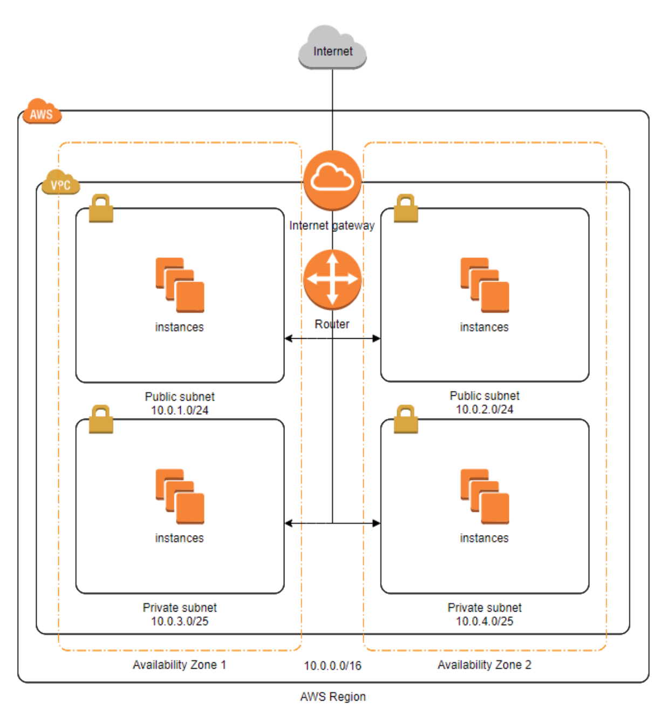

# 1단계 - 서비스 구성하기

## 요구사항

- [X] 웹 서비스를 운영할 네트워크 망 구성하기
- [X] 웹 애플리케이션 배포하기

## 망 구성 방식
- [X] VPC 생성
  - CIDR은 C class(x.x.x.x/24)로 생성. 이 때, 다른 사람과 겹치지 않게 생성
- [X] Subnet 생성
  - 외부망으로 사용할 Subnet : 64개씩 2개 (AZ를 다르게 구성)
  - 내부망으로 사용할 Subnet : 32개씩 1개
  - 관리용으로 사용할 Subnet : 32개씩 1개
- [X] Internet Gateway 연결
- [X] Route Table 생성
- [X] Security Group 설정
  - [X] 외부망
    - 전체 대역 : 8080 포트 오픈
    - 관리망 : 22번 포트 오픈
  - [X] 내부망 
    - 외부망 : 3306 포트 오픈 
    - 관리망 : 22번 포트 오픈
  - [X] 관리망
    - 자신의 공인 IP : 22번 포트 오픈 
- [X] 서버 생성 
  - 외부망에 웹 서비스용도의 EC2 생성 
  - 내부망에 데이터베이스용도의 EC2 생성 
  - 관리망에 베스쳔 서버용도의 EC2 생성 
  - 베스쳔 서버에 Session Timeout 600s 설정 
  - 베스쳔 서버에 Command 감사로그 설정

## 웹 애플리케이션 배포
- [X] 외부망에 웹 애플리케이션을 배포
- [X] DNS 설정

# 🚀 2단계 - 서비스 배포하기

- [X] 운영 환경 구성
- [X] 개발 환경 구성

## 요구사항 설명
- [X] 웹 애플리케이션 앞단에 Reverse Proxy 구성하기
  - [X] 외부망에 Nginx로 Reverse Proxy를 구성
  - [X] Reverse Proxy에 TLS 설정
- [X] 운영 데이터베이스 구성하기

## 개발 환경 구성하기
- [X] 설정 파일 나누기
  - JUnit : h2, Local : docker(mysql), Prod : 운영 DB를 사용하도록 설정
