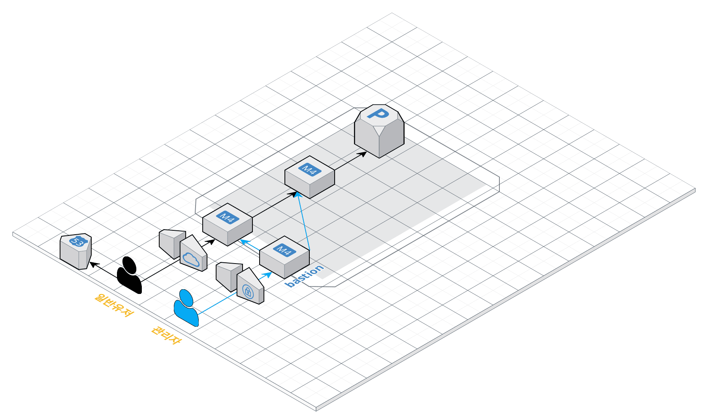

### 그럴듯한 서비스 만들기

학습 목표

- AWS 상에서 네트워크를 구성하며, 네트워크 기본 개념들을 학습해보아요.
- 컨테이너를 학습하고 3 tier로 운영환경을 구성해봅니다.
- 개발 환경을 구성해보고 지속적 통합을 경험해봅니다.

---

### 1. 서비스 구성하기

요구사항
- 웹 서비스를 운영할 네트워크 망 구성하기
- 웹 애플리케이션 배포하기

요구사항 설명
- [저장소](https://github.com/next-step/infra-subway-deploy) 를 활용하여 아래 요구사항을 해결합니다.
- README 에 있는 질문에 답을 추가한 후 PR을 보내고 리뷰요청을 합니다.

망 구성
- VPC 생성
  - CIDR은 C class(x.x.x.x/24)로 생성. 이 때, 다른 사람과 겹치지 않게 생성
- Subnet 생성
  - 외부망으로 사용할 Subnet : 64개씩 2개 (AZ를 다르게 구성)
  - 내부망으로 사용할 Subnet : 32개씩 1개
  - 관리용으로 사용할 Subnet : 32개씩 1개
- Internet Gateway 연결
- Route Table 생성
- Security Group 설정
  - 외부망
    - 전체 대역 : 8080 포트 오픈
    - 관리망 : 22번 포트 오픈
  - 내부망
    - 외부망 : 3306 포트 오픈
    - 관리망 : 22번 포트 오픈
  - 관리망
    - 자신의 공인 IP : 22번 포트 오픈
- 서버 생성
  - 외부망에 웹 서비스용도의 EC2 생성
  - 내부망에 데이터베이스용도의 EC2 생성
  - 관리망에 베스쳔 서버용도의 EC2 생성
  - 베스쳔 서버에 Session Timeout 600s 설정
  - 베스쳔 서버에 Command 감사로그 설정

*주의사항
- 다른 사람이 생성한 리소스는 손대지 말아요 🙏🏻
- 모든 리소스는 태그를 작성합니다. 이 때 자신의 계정을 Prefix로 붙입니다. (예: brainbackdoor-public)

웹 애플리케이션 배포
- 외부망에 [웹 애플리케이션](https://github.com/next-step/infra-subway-deploy) 을 배포
- DNS 설정

---

### 1. EC2 생성하기
- [aws web console](https://awsx100.signin.aws.amazon.com/console) 에 사용자 이름 / 비밀번호 등을 입력하여 접속합니다.
  - 아이디 : github id
  - 초기 비밀번호 : 
- EC2 메뉴로 접근하세요.
  - Ubuntu 64 bit 선택 (Ubuntu Server 18.04 LTS (HVM), SSD Volume Type - ami-00edfb46b107f643c)
  - InstanceType : t3.medium 생성 가능
  - 서브넷 : 적절한 서브넷 선택, 퍼블릭 IP 자동할당 : 활성화
  - 스토리지 : 서비스 운영할 것을 고려해서 설정해주세요.
  - 서버를 생성할 때는 다른 사람의 서버와 구분하기 위해 반드시 Name 이름으로 태그에 자신의 계정명을 작성합니다.
  - 보안그룹 : 적절한 보안그룹을 선택
  - 키 페어 생성
    - 키 페어 이름에 자신의 계정을 prefix로 붙입니다.
    - 서버 생성시 발급받은 key를 분실할 경우 서버에 접속할 수 없어요. 
      - key를 분실하지 않도록 주의하세요, key는 최초 1회 생성한 후 재사용합니다.
- 서버에 접속하기
  - 서버 IP는 aws web console에서 확인 가능
  - 맥 운영체제 사용자
    - 터미널 접속한 후 앞 단계에서 생성한 key가 위치한 곳으로 이동한다.
    - chmod 400 [pem파일명]
    - ssh -i [pem파일명] ubuntu@[SERVER_IP]
  - 윈도우즈 운영체제 사용자
    - [PuTTY를 사용하여 Windows에서 Linux 인스턴스에 연결](https://docs.aws.amazon.com/ko_kr/AWSEC2/latest/UserGuide/putty.html)
    - [putty를 위한 ppk 생성](https://klero.tistory.com/entry/AWS-EC2-%EC%82%AC%EC%9A%A9-pem%ED%82%A4-ppk%EB%A1%9C-%EB%B3%80%ED%99%98%ED%95%98%EC%97%AC-Putty-SSH-%EC%A0%91%EC%86%8D%EB%B0%A9%EB%B2%95)

--- 

### 2. 접근통제

Bastion 이란, 성 외곽을 보호하기 위해 돌출된 부분으로 적으로부터 효과적으로 방어하기 위한 수단입니다. 이를 우리의 아키텍쳐에도 적용해볼 수 있습니다.

가령, 우리가 터미널에 접속하기 위해 사용하는 22번 포트를 한번 생각해보아요. 22번 포트의 경우 보안이 뚫린다면 서비스에 심각한 문제를 일으킬 수 있습니다. 그렇다고, 모든 서버에 동일 수준의 보안을 설정하고자 한다면, Auto-Scaling 등 확장성을 고려한 구성과 배치됩니다. 이 경우 관리 포인트가 늘어나기에 일반적으로는 보안 설정을 일정 부분을 포기하는 결정을 하게 됩니다. 만약 Bastion Server가 있다면, 악성 루트킷, 랜섬웨어 등으로 피해를 보더라도 Bastion Server만 재구성하면 되므로, 서비스에 영향을 최소화할 수 있습니다.

추가적으로, 서비스 정상 트래픽과 관리자용 트래픽을 구분할 수 있다는 이점이 있습니다. 가령, 서비스가 DDos 공격을 받아 대역폭을 모두 차지하고 있다면 일반적인 방법으로 서비스용 서버에 접속하기는 어렵기 때문에 별도의 경로를 확보해둘 필요가 있습니다.

따라서, 22번 Port 접속을 Bastion 서버에 오픈하고 그 서버에 보안을 집중하는 것이 효율적입니다.

📌 Bastion Server로 사용할 별도의 EC2를 생성하고, Bastion Server에서 서비스용 서버에 ssh 연결을 설정해봅시다.
```
## Bastion Server에서 공개키를 생성합니다.
bastion $ ssh-keygen -t rsa
bastion $ cat ~/.ssh/id_rsa.pub

## 접속하려는 서비스용 서버에 키를 추가합니다.
$ vi ~/.ssh/authorized_keys

## Bastion Server에서 접속을 해봅니다.
bastion $ ssh ubuntu@[서비스용 서버 IP]
```

📌 Bastion Server는 자신의 공인 IP에서만 22번 포트로 접근이 가능하도록 Security Group을 설정합니다.

📌 서비스용 서버에 22번 포트로의 접근은 Bastion 서버에서만 가능하도록 Security Group을 설정합니다.

📌 Bastion 서버에서 다른 서버에 접근이 용이하도록 별칭을 설정합니다.
```
bastion $ vi /etc/hosts
[서비스용IP]    [별칭]

bastion $ ssh [별칭]
```

### 3. 서버 환경설정 해보기

환경변수 적용하기
- Sessio Timeout 설정을 하여 일정 시간 작업을 하지 않을 경우 터미널 연결을 해제할 수 있습니다.
```
$ sudo vi ~/.profile
  HISTTIMEFORMAT="%F %T -- "    ## history 명령 결과에 시간값 추가
  export HISTTIMEFORMAT
  export TMOUT=600              ## 세션 타임아웃 설정 
    
$ source ~/.profile
$ env
```

shell prompt 변경하기
- Bastion 등 구분해야 하는 서버의 Shell Prompt를 설정하여 관리자의 인적 장애를 예방할 수 있습니다.
  - [쉘변수](https://webdir.tistory.com/105)
  - [PS1 generator](https://ezprompt.net/)
```
$ sudo vi ~/.bashrc
  USERNAME=BASTION
  PS1='[\e[1;31m$USERNAME\e[0m][\e[1;32m\t\e[0m][\e[1;33m\u\e[0m@\e[1;36m\h\e[0m \w] \n\$ \[\033[00m\]'

$ source ~/.bashrc
```

[logger](https://zetawiki.com/wiki/%EB%A6%AC%EB%88%85%EC%8A%A4_logger) 를 사용하여 감사로그 남기기
- 서버에 직접 접속하여 작업할 경우, 작업 이력 히스토리를 기록해두어야 장애 발생시 원인을 분석할 수 있습니다. 감사로그를 기록하고 수집해봅니다.
```
$ sudo vi ~/.bashrc
  tty=`tty | awk -F"/dev/" '{print $2}'`
  IP=`w | grep "$tty" | awk '{print $3}'`
  export PROMPT_COMMAND='logger -p local0.debug "[USER]$(whoami) [IP]$IP [PID]$$ [PWD]`pwd` [COMMAND] $(history 1 | sed "s/^[ ]*[0-9]\+[ ]*//" )"'

$ source  ~/.bashrc
```

```
$ sudo vi /etc/rsyslog.d/50-default.conf
  local0.*                        /var/log/command.log
  # 원격지에 로그를 남길 경우 
  local0.*                        @원격지서버IP
    
$ sudo service rsyslog restart
$ tail -f /var/log/command.log
```

### 4. 환경 세팅

확인
```
# 현재 위치를 확인합니다.
$ pwd

# 파일시스템별 가용공간을 확인합니다.
$ df -h

# 각 디렉토리별로 디스크 사용량을 확인합니다.
$ sudo du -shc /*

# 현재 경로의 파일들(숨김파일 포함)의 정보를 확인합니다.
$ ls -al

# 소스코드를 관리할 디렉토리를 생성하고 이동합니다.
$ mkdir nextstep && cd nextstep

# git 명령어의 위치를 확인해봅니다.
$ which git && which java
```

자바 설치
```
$ sudo apt update
$ sudo apt install default-jre
$ sudo apt install default-jdk
```

### 5. 소스코드 배포, 빌드 및 실행

github repository clone

빌드
```
$ ./gradlew clean build

# jar파일을 찾아본다.
$ find ./* -name "*jar"
```

실행
- Application을 실행 후 정상적으로 동작하는지 확인해보세요.
```
$ java -jar [jar파일명] & 
  
$ curl http://localhost:8080
```
- Dserver.port=8000 옵션을 활용하여 port를 변경할 수 있어요.
- 서버를 시작 시간이 너무 오래 걸리는 경우 -Djava.security.egd 옵션을 적용해보세요.
  - 이 옵션을 붙이는 이유가 궁금하다면 [tomcat 구동 시 /dev/random 블로킹 이슈](https://lng1982.tistory.com/261) 참고.
```
$ java -Djava.security.egd=file:/dev/./urandom -jar [jar파일명] &
```
- 터미널 세션이 끊어질 경우, background로 돌던 프로세스에 hang-up signal이 발생해 죽는 경우가 있는데요. 이 경우 nohup명령어를 활용합니다.
```
$  nohup java -jar [jar파일명] 1> [로그파일명] 2>&1  &
```

로그 확인
```
# java applicaion이 남기는 로그를 확인합니다.
$ tail -f [로그파일명]

# 파일을 압축하고 파일 소유자와 모드를 변경해봅니다.
$ tar -cvf [파일명] [압축할파일 또는 디렉터리]
$ sudo chown [소유자계정명]:[소유그룹명] [file이름] 
$ chmod [옵션] [파일명]

> https://ko.wikipedia.org/wiki/Chmod
```
- 브라우저에서 http://{서버 ip}:{port}로 접근해보세요.

종료
- 프로세스 pid를 찾는 명령어
```
$ ps -ef | grep java
$ pgrep -f java
```

- 프로세스를 종료하는 명령어
  - why not use SIGKILL
    - https://stackoverflow.com/questions/2541475/capture-sigint-in-java
```
$ kill -2 [PID]
``` 

명령어 이력 확인
```
$ history
```

DNS 설정
- [무료 도메인 사이트](https://내도메인.한국/) 들을 활용하여 DNS 설정을 합니다.
