# 2단계 - 서비스 배포하기

## 1. 요구사항 정의

### 1.1. 명시된 요구사항

#### 1.1.1. 요구사항

- 운영 환경 구성하기
- 개발 환경 구성하기

##### 1.1.1.1. 요구사항 설명

1. 운영 환경 구성하기
    - 웹 애플리케이션 앞단에 Reverse Proxy 구성하기
        - 외부망에 Nginx로 Reverse Proxy를 구성
        - Reverse Proxy에 TLS 설정
    - 운영 데이터베이스 구성하기
2. 개발 환경 구성하기
    - 설정 파일 나누기
        - JUnit : h2, Local : docker(mysql), Prod : 운영 DB를 사용하도록 설정
    - 데이터베이스 테이블 스키마 버전 관리
    - SonarLint 설정하기
    - MultiRun 설정하기

#### 1.1.2. 힌트

- [그럴듯한 서비스 만들기 : 2단계 - 서비스 배포하기](https://edu.nextstep.camp/s/ffeVDScX/ls/iYZi0uIQ)

### 1.2. 기능 요구사항 정리

|구분 | 상세 |구현방법     |
|:----:  |:------  |:---------|
|운영 환경 구성하기|• 외부망에 Nginx로 Reverse Proxy를 구성|• Nginx로 Reverse Proxy를 구성|
|운영 환경 구성하기|• 외부망에 Nginx로 Reverse Proxy를 구성|• TLS 설정|
|운영 환경 구성하기|• 운영 데이터베이스 구성하기|• Database 설치(docker(mysql))<br>• Database 설치(prod)|
|개발 환경 구성하기|• 설정 파일 나누기|• JUnit : h2, Local : docker(mysql), Prod : 운영 DB를 사용하도록 설정|
|개발 환경 구성하기|• 데이터베이스 테이블 스키마 버전 관리|• flyway 적용|
|개발 환경 구성하기|• SonarLint 설정하기|• [SonarLint 참조](http://redutan.github.io/2018/04/11/intellij-sonarlint-plugin)|
|개발 환경 구성하기|• MultiRun 설정하기|• IntelliJ의 Multirun 플러그인을 활용|
|개발 환경 구성하기|• 설정 별도로 관리하기|• git의 [서브모듈 기능](https://git-scm.com/book/ko/v2/Git-%EB%8F%84%EA%B5%AC-%EC%84%9C%EB%B8%8C%EB%AA%A8%EB%93%88) 을 활용|

## 2. 분석 및 설계

### 2.1. 이번 Step 핵심 목표

#### 2.1.1. 서비스 배포하기

- 잘 모르는 분야겠지만 화이팅! :fire:

### 2.2. Todo List

- [x] 0.기본 세팅
    - [x] 0-1.git fork/clone
        - [x] 0-1-1.NEXTSTEP 내 과제로 이동 및 '미션시작'
        - [x] 0-1-2.실습 github으로 이동
        - [x] 0-1-3.branch 'gregolee'로 변경
        - [x] 0-1-4.fork
        - [x] 0-1-5.clone : `git clone -b gregolee --single-branch https://github.com/gregolee/infra-subway-deploy.git`
        - [x] 0-1-6.branch : `git checkout -b step1`
    - [x] 0-2.요구사항 정리
    - [x] 0-3.[AngularJS Commit Message Conventions](https://gist.github.com/stephenparish/9941e89d80e2bc58a153#generating-changelogmd) 참고
    - [x] 0-4.Slack을 통해 merge가 되는지 확인한 후에 코드 리뷰 2단계 과정으로 다음 단계 미션을 진행
        - [x] 0-4-1.gregolee(master) branch로 체크아웃 : `git checkout gregolee`
        - [x] 0-4-2.step1 branch 삭제 : `git branch -D step1`
        - [x] 0-4-3.step1 branch 삭제 확인 : `git branch -a`
        - [x] 0-4-4.원본(next-step) git repository를 remote로 연결 (미션 당 1회) : `git remote add -t gregolee upstream https://github.com/next-step/infra-subway-deploy`
        - [x] 0-4-5.원본(next-step) git repository를 remote로 연결 확인 : `git remote -v`
        - [x] 0-4-6.원본(next-step) git repository에서 merge된 나의 branch(gregolee)를 fetch : `git fetch upstream gregolee`
        - [x] 0-4-7.remote에서 가져온 나의 branch로 rebase : `git rebase upstream/gregolee`
        - [x] 0-4-7.gregolee -> step2로 체크아웃 : `git checkout -b step2`
    - [x] 0-5.리뷰어님의 리뷰를 반영한 코드로 수정
        - [x] 0-5-1.적용사항 없음
- [x] 1.자바 코드 컨벤션을 위한 세팅 (skip)
- [x] 2.학습
    - [x] 2-1.infra 강의 듣기
- [x] 3.분석 및 설계
    - [x] 3-1.step02.md 초안 작성
- [x] 4.구현
    - [x] 4-1. 운영 환경 구성하기
        - [x] 4-1-1. 웹 애플리케이션 앞단에 Reverse Proxy 구성하기
            - [x] 4-1-1-1. 외부망에 Nginx로 Reverse Proxy를 구성
            - [x] 4-1-1-2. Reverse Proxy에 TLS 설정
        - [x] 4-1-2. 운영 데이터베이스 구성하기
    - [x] 4-2. 개발 환경 구성하기
        - [x] 4-2-1. 설정 파일 나누기
            - [x] 4-2-1-1. JUnit : h2, Local : docker(mysql), Prod : 운영 DB를 사용하도록 설정
        - [x] 4-2-2. 데이터베이스 테이블 스키마 버전 관리
        - [x] 4-2-3. SonarLint 설정하기
        - [x] 4-2-4. MultiRun 설정하기
    - [x] 4-3. 서브넷 : gregolee-private - 인터넷 게이트웨이 제거하기
    - [x] 4-4. 서브모듈 기능 적용
- [x] 5.테스트
    - [x] 5-1.요구사항 조건들 충족했는지 확인
    - [x] 5-2.서버 확인
- [x] 6.인수인계
    - [x] 6-1.소감 및 피드백 정리
        - [x] 6-1-1.느낀점 & 배운점 작성
        - [x] 6-1-2.피드백 요청 정리
    - [x] 6-2.코드리뷰 요청 및 피드백
        - [x] 6-1-1.step2를 gregolee/infra-subway-deploy로 push : `git push origin step2`
        - [x] 6-1-2.pull request(PR) 작성
    - [x] 6-3.Slack을 통해 merge가 되는지 확인한 후에 미션 종료

## 3. 인수인계

### 3.1. 느낀점 & 배운점

#### 3.1.1. 느낀점

- 단순하리라 생각했던 세팅이 그리 쉽지 않았음을 깨달았습니다.
    - sonarlint : 교육 과정이 끝난 후에 잘 활용해볼 수 있도록 해봐야겠습니다. (sonarqube를 서버에서 공통으로 관리할 수 있도록)
    - flyway : 적용은 다소 시간이 걸렸으나, 잘 활용하는 법을 어떻게 할지 정책으로나 활용에 대한 고민이 필요할 것 같습니다.
    - Nginx : 일반적으로 apache를 통하여 web server를 접했지만, 직접 설치 및 활용하는 것은 처음 해보았습니다. 직접 활용하는 경우가 많으니 심화된 학습을 하도록 해야겠습니다.
    - springboot 'spring.profiles.active' 설정 관리에 대해 알고 있었지만, 직접 활용을 안했었습니다.
        - 직접 사용해보니 보다 더 편리하게 관리할 수 있었습니다.
        - 기존 properties를 직접 수정하여 사용하는 것이 불편했었는데, 이 기회에 실무에서 잘 사용하도록 하겠습니다.

#### 3.1.2. 배운점

- Window10 Error : [AWS] permissions for pem are too open
    - [에러해결 참조 페이지](https://mocadev.tistory.com/43)
    - 에러 표시
        ```shell script
        C:\...>ssh -i ******.pem ubuntu@***.***.***.***
        The authenticity of host '***.***.***.*** (***.***.***.***)' can't be established.
        ECDSA key fingerprint is SHA256:ZVQCG5ubV...3JI.
        Are you sure you want to continue connecting (yes/no/[fingerprint])? yes
        Warning: Permanently added '***.***.***.***' (ECDSA) to the list of known hosts.
        @@@@@@@@@@@@@@@@@@@@@@@@@@@@@@@@@@@@@@@@@@@@@@@@@@@@@@@@@@@
        @         WARNING: UNPROTECTED PRIVATE KEY FILE!          @
        @@@@@@@@@@@@@@@@@@@@@@@@@@@@@@@@@@@@@@@@@@@@@@@@@@@@@@@@@@@
        Permissions for '******.pem' are too open.
        It is required that your private key files are NOT accessible by others.
        This private key will be ignored.
        Load key "******.pem": bad permissions
        ubuntu@***.***.***.***: Permission denied (publickey).
        
        C:\...>
        ```
    - 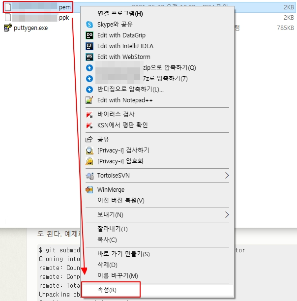
    - 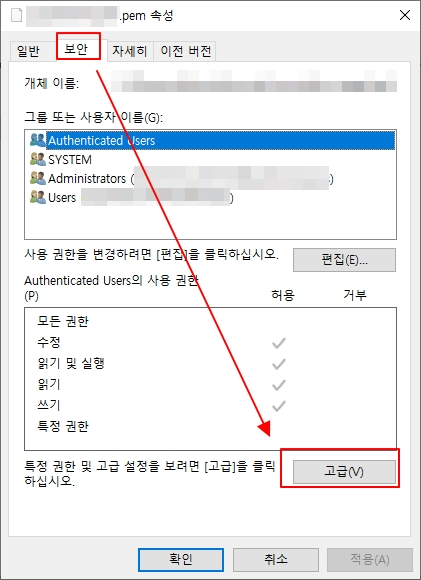
    - 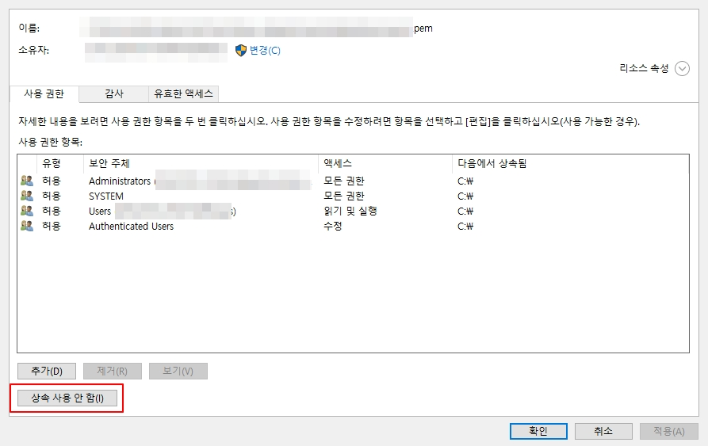
    - 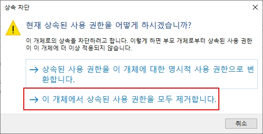
    - 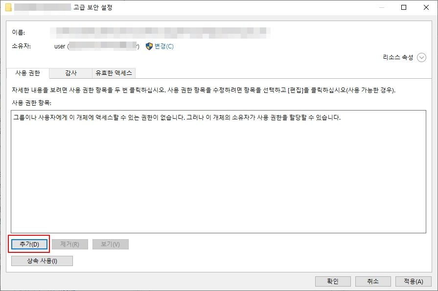
    - 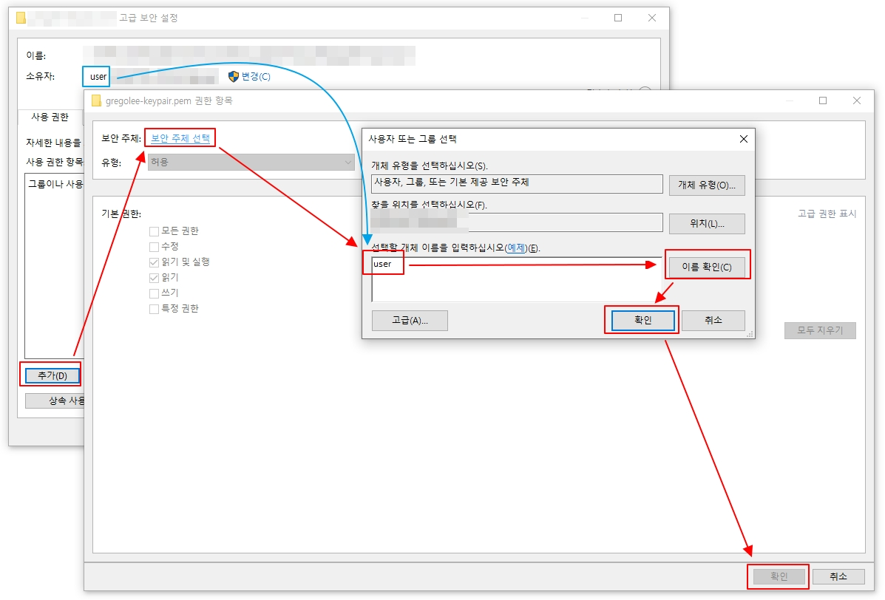
    - 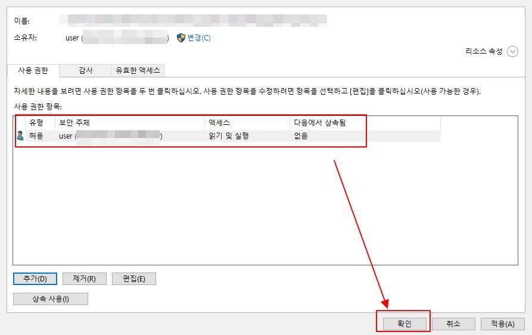
    - 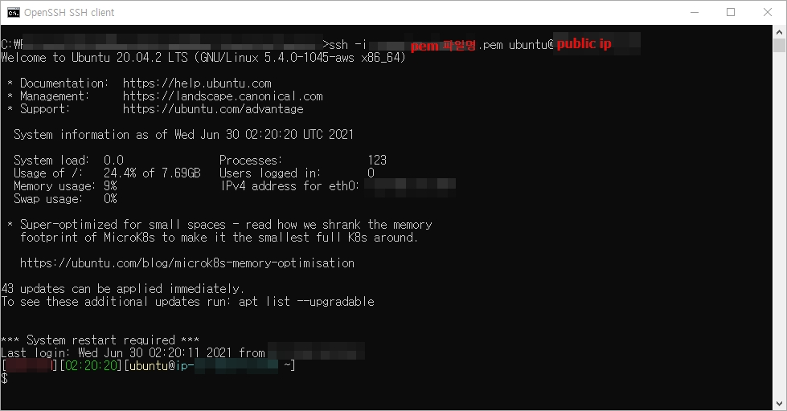

- Windows10 putty로 AWS 접속하기
    - .pem파일을 통하여 접속하려하면 다음과 같이 접속되지 않는다.
    - 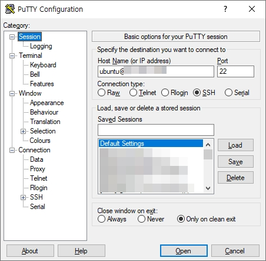
    - 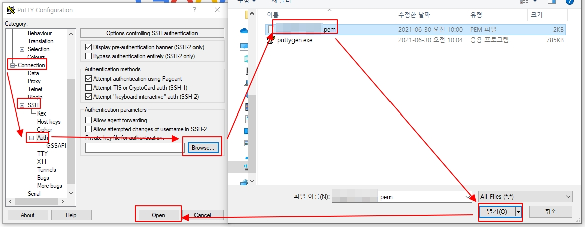
    - 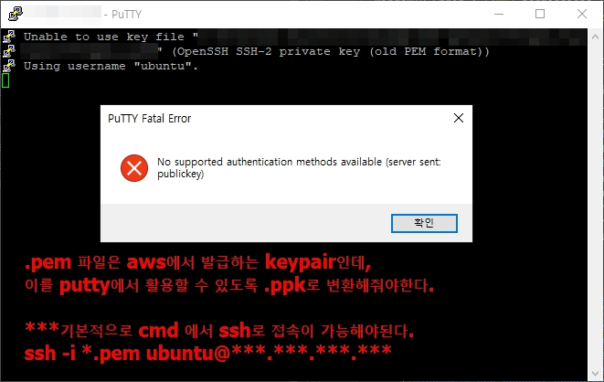
    
    - [AWS 공식 putty 접속 가이드 문서](https://docs.aws.amazon.com/ko_kr/AWSEC2/latest/UserGuide/putty.html)
        - 다음과 같이 진행한다면 이와 같은 에러를 만나게 된다.
        - 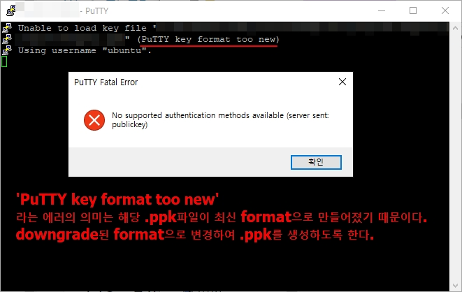
        
    - 다음과 같이 진행하면 접속이 가능하다.
        - 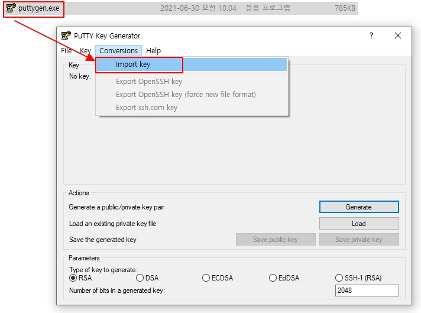
        - 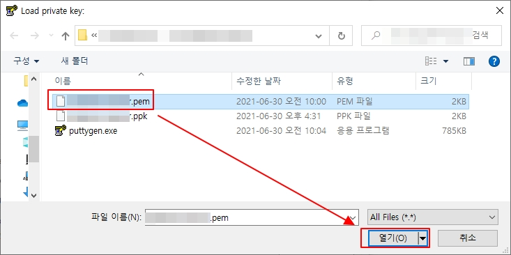
        - 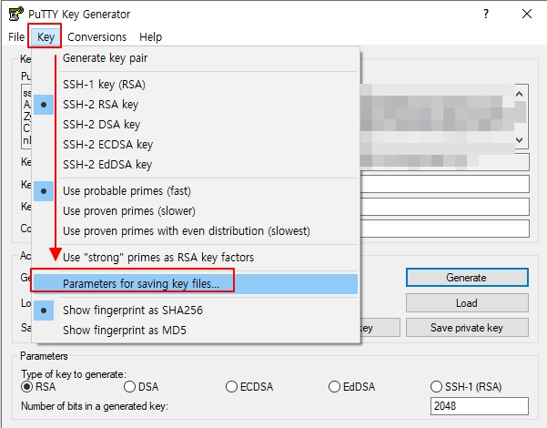
        - 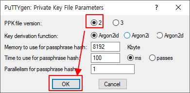
        - 
        - 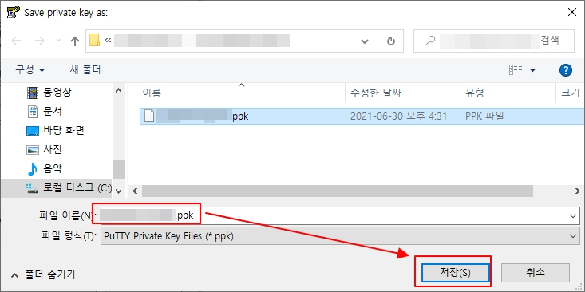
        - 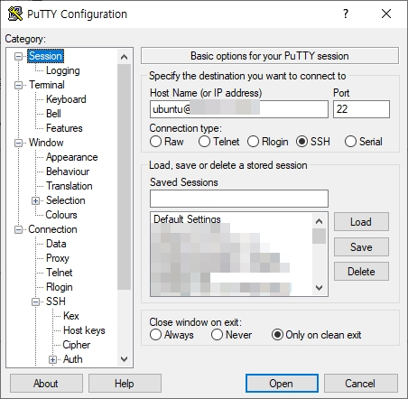
        - 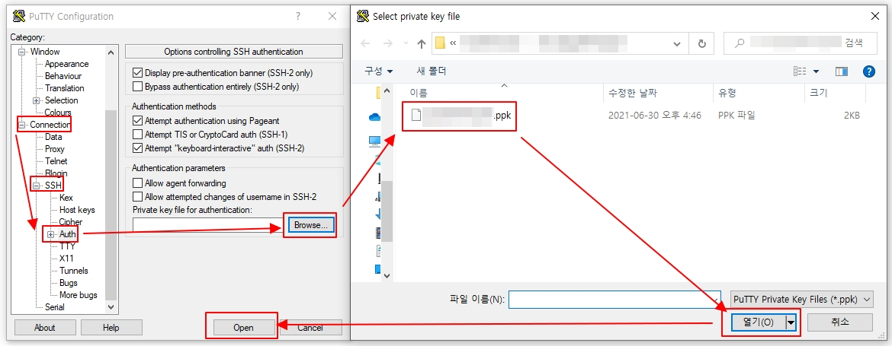
        - 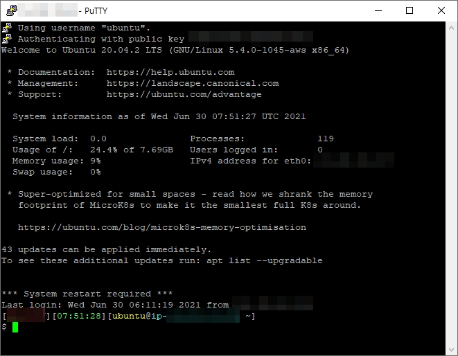

- 명령어
    - 실행
        - test(h2) : `nohup java -Dspring.profiles.active=test -jar ./build/libs/subway-0.0.1-SNAPSHOT.jar  1> ./logs/infra-subway-deploy-20210628.log 2>&1  &`
        - local(mysql) : `nohup java -Dspring.profiles.active=local -jar ./build/libs/subway-0.0.1-SNAPSHOT.jar  1> ./logs/infra-subway-deploy-20210628.log 2>&1  &`
        - prod(mysql) : `nohup java -Dspring.profiles.active=prod -jar ./build/libs/subway-0.0.1-SNAPSHOT.jar  1> ./logs/infra-subway-deploy-20210628.log 2>&1  &`
    - root password : qwerty123456
    
- sonarlint
    - sonarlint 는 gregolee-admin 에 docker 기반으로 설치되어 연동해두었음.
    - 그러나 상세 프로젝트 설정은 후일에 활용해봐야할 것 같음.

- multirun
    - 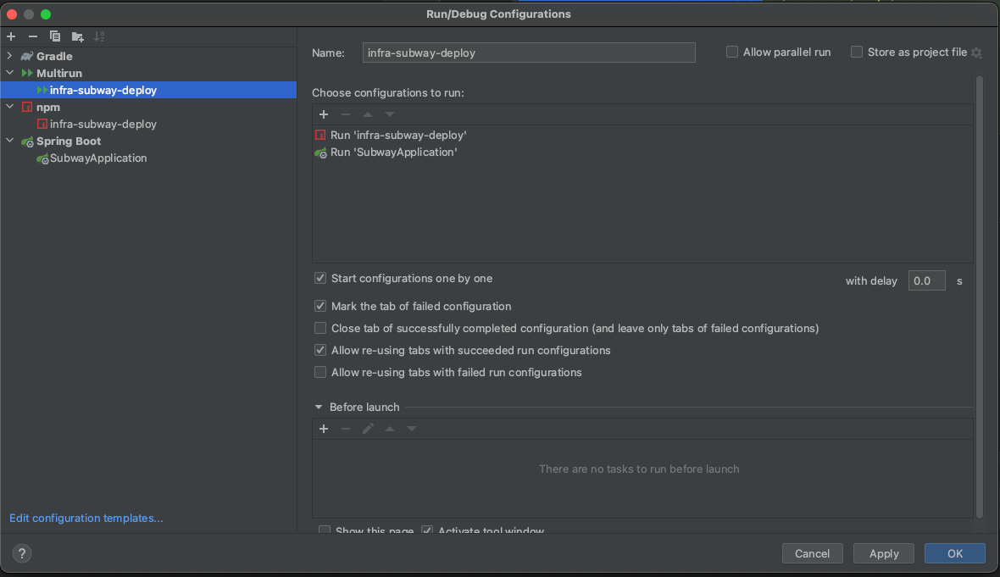

- SSL 적용기
    - 수많은 시행착오 끝에 도달했다. (별의별 뻘짓을 다했었다.)
    - SSL이 적용되지 않았던 이유
        - 정확한 도메인의 SSL인증서를 발급하지 않았던 것.
        - 여태까지 `gregolee.n-e.kr`의 인증서만 발급받아서 `infra.gregolee.n-e.kr`는 인증되지 않았던 것이다.
        
    - 정확하게 다시 받아보자.
        - `-d 'gregolee.n-e.kr'` ===> `-d 'infra.gregolee.n-e.kr'` 
        ```
        docker run -it --rm --name certbot \
          -v '/etc/letsencrypt:/etc/letsencrypt' \
          -v '/var/lib/letsencrypt:/var/lib/letsencrypt' \
          certbot/certbot certonly -d 'infra.gregolee.n-e.kr' --manual --preferred-challenges dns --server https://acme-v02.api.letsencrypt.org/directory
        ```
        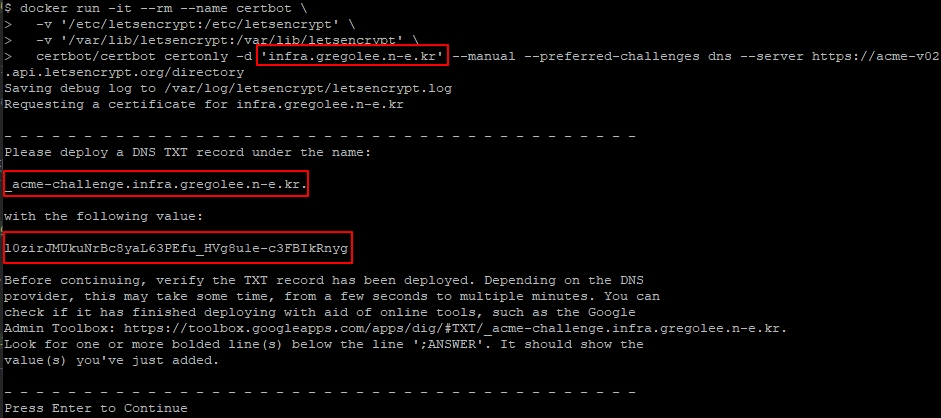
        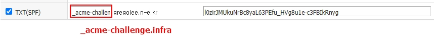
    - 나머지는 힌트에서 나온 내용과 동일하게 진행한다.
        [힌트로 이동](https://edu.nextstep.camp/s/ffeVDScX/ls/iYZi0uIQ)
        

### 3.2. 피드백 요청

- 
