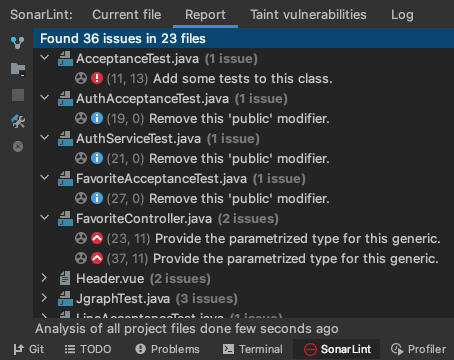

# 🚀 2단계 - 서비스 배포하기

## 요구사항

1. TLS가 적용된 URL을 알려주세요
   - URL : https://우테캠.웹.한국

### 운영 환경 구성하기

- [X] 웹 애플리케이션 앞단에 Reverse Proxy 구성하기
  - [X] 외부망에 Nginx로 Reverse Proxy를 구성
    - mskangg-EC2-web -> mskangg-EC2-was:8080
  - [X] Reverse Proxy에 TLS 설정
- [X] 운영 데이터베이스 구성하기

### 개발 환경 구성하기

- [X] 설정 파일 나누기
  - [X] JUnit : h2, Local : docker(mysql), Prod : 운영 DB를 사용하도록 설정
- [X] 데이터베이스 테이블 스키마 버전 관리
- [X] SonarLint 설정하기
  - 
- [ ] MultiRun 설정하기
