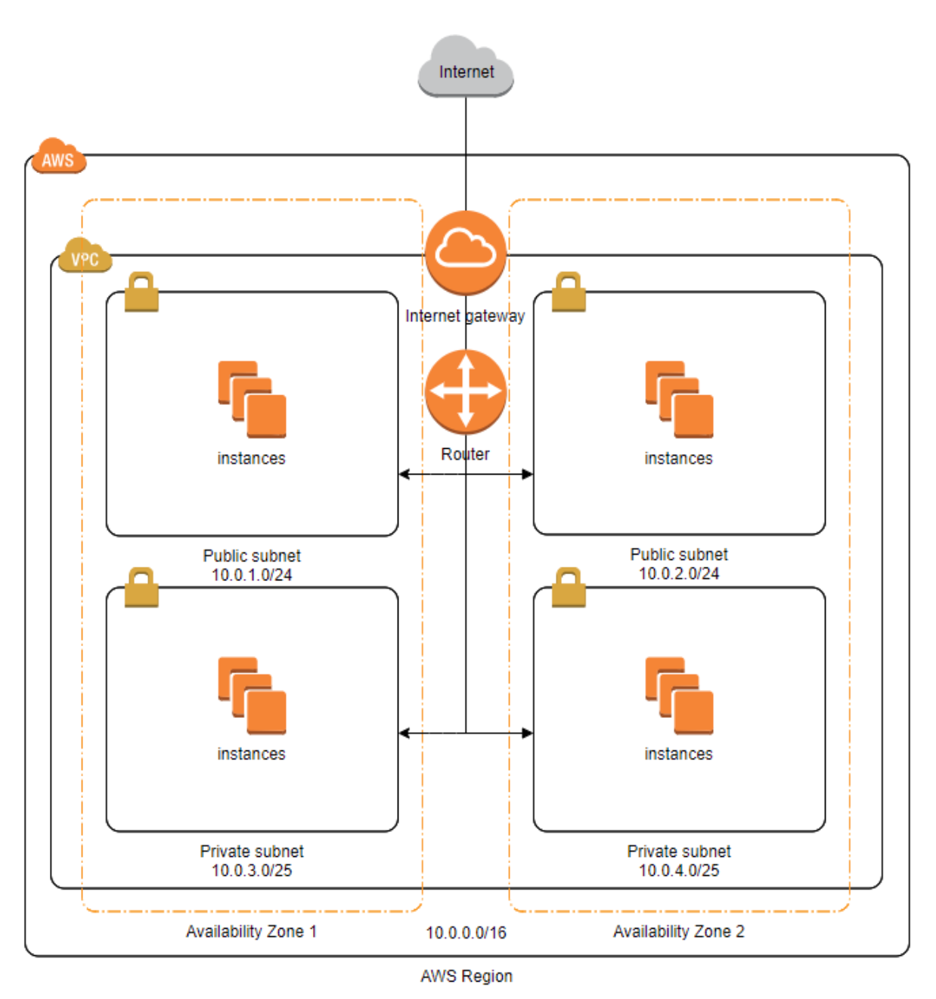

# 🚀 1단계 - 서비스 구성하기

## 요구사항

- 웹 서비스를 운영할 네트워크 망 구성하기
- 웹 애플리케이션 배포하기

## 요구사항 설명
- [저장소](https://github.com/next-step/infra-subway-deploy)를 활용하여 아래 요구사항을 해결합니다.
- README 에 있는 질문에 답을 추가한 후 PR을 보내고 리뷰요청을 합니다.

- 망구성
  - [x] VPC 생성
    - CIDR은 C class(x.x.x.x/24)로 생성. 이 때, 다른 사람과 겹치지 않게 생성 
      - **mond-page-vpc(192.168.255.0/24)**
  - [x] Subnet 생성
    - [x] 외부망으로 사용할 Subnet : 64개씩 2개 (AZ를 다르게 구성)
      - **mond-page-public-subnet-01(192.168.255.192/26), mond-page-public-subnet-02(192.168.255.128/26)**
    - [x] 내부망으로 사용할 Subnet : 32개씩 1개
      - **mond-page-private-subnet-01(192.168.255.96/27)**
    - [x] 관리용으로 사용할 Subnet : 32개씩 1개
      - **mond-page-manage-subnet-01(192.168.255.5/27)**
  - [x] Internet Gateway 연결
    - **mond-page-igw** 
  - [x] Route Table 생성
    - **mond-page-rtb**
  - [x] Security Group 설정
    - [x] 외부망
      - 전체 대역 : 8080 포트 오픈
      - 관리망 : 22번 포트 오픈
      - **mond-page-sg-public**
    - [x] 내부망
      - 외부망 : 3306 포트 오픈
      - 관리망 : 22번 포트 오픈
      - **mond-page-sg-private**
    - [x] 관리망
      - 자신의 공인 IP : 22번 포트 오픈
      - **mond-page-sg-manage**
  - [x] 서버 생성
    - [x] 외부망에 웹 서비스용도의 EC2 생성
      - **mond-page-service-public-a, mond-page-service-public-b**
    - [x] 내부망에 데이터베이스용도의 EC2 생성
      - **mond-page-db**
    - [x] 관리망에 베스쳔 서버용도의 EC2 생성
      - **mond-page-bastion**
    - [x] 베스쳔 서버에 Session Timeout 600s 설정
    - [x] 베스쳔 서버에 Command 감사로그 설정

## 웹 애플리케이션 배포
- [x] 외부망에 웹 애플리케이션을 배포
- [x] DNS 설정

### 📚 Todo List 📚
- [x] 망 구성하기
- [x] 웹 애플리케이션 배포하기
- [x] DNS 설정하기
- [x] pem 키 생성 후 업로드하기
- [x] 미션에 답하기
